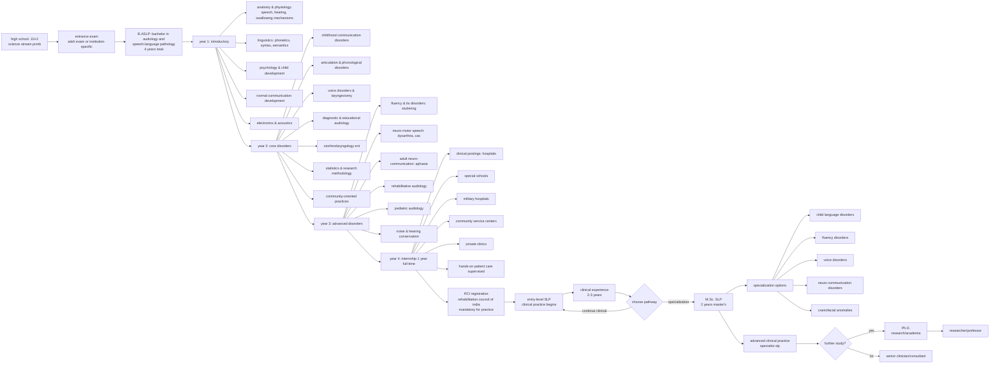

# child speech sound disorders: comprehensive taxonomy and therapy framework

## overview

this document provides comprehensive research on child speech sound disorders (ssds), focusing on early childhood (ages 2-8 years). it covers taxonomy, prevalence, etiology, assessment frameworks, intervention approaches, and clinical decision-making pathways. emphasis is placed on the indian context where relevant, including slp curriculum and assessment standards.

---

## 1. disorder classification and taxonomy

### 1.1 speech sound disorders (ssds) - overarching category

speech sound disorders (ssds) is a generic term describing a range of difficulties producing speech sounds in children. ssds refer to any difficulty or combination of difficulties with:
- perception (how sounds are heard and processed)
- motor production (physical ability to produce sounds)
- phonological representation (cognitive understanding of sound patterns)

### 1.2 etiological classification

#### 1.2.1 organic ssds
disorders resulting from identifiable structural, neurological, or sensory causes:

**a. motor/neurological disorders**
- childhood apraxia of speech (cas)
- dysarthria (pediatric)

**b. structural abnormalities**
- cleft lip/palate
- velopharyngeal dysfunction (vpd)
- other craniofacial anomalies
- tongue-tie (ankyloglossia)

**c. sensory/perceptual disorders**
- hearing loss
- auditory processing difficulties

#### 1.2.2 idiopathic ssds
disorders with no known cause (most common type):

**a. functional articulation disorders**
- difficulty producing specific speech sounds
- motor-based production errors
- typically affect specific phonemes (sounds)

**b. phonological disorders**
- pattern-based errors affecting multiple sounds
- cognitive-linguistic basis
- involve phonological processes (simplification patterns)

**c. inconsistent speech disorder**
- highly variable speech productions
- difficulty with motor planning
- 10+ inconsistent productions out of 25-word sample

### 1.3 specific disorder types

#### 1.3.1 articulation disorders
- **definition**: difficulty with motor production of specific speech sounds
- **characteristics**: consistent substitution, omission, or distortion of particular phonemes
- **typical sounds affected**: /r/, /l/, /s/, /z/, /sh/, /ch/, /th/
- **etiology**: motor learning difficulties, structural issues, or unknown

#### 1.3.2 phonological disorders
- **definition**: pattern-based errors affecting classes of sounds
- **characteristics**: systematic simplification patterns (phonological processes)
- **basis**: cognitive-linguistic; child doesn't understand the rules for using sounds to change word meanings
- **common patterns**:
  - fronting (back sounds replaced with front sounds: "tar" for "car")
  - stopping (fricatives replaced with stops: "top" for "shop")
  - cluster reduction ("poon" for "spoon")
  - final consonant deletion ("ca" for "cat")
  - gliding (/r/ or /l/ replaced with /w/ or /y/)
  - prevocalic voicing (voiceless sounds become voiced at word beginning)
  - devoicing (voiced sounds become voiceless)

#### 1.3.3 childhood apraxia of speech (cas)
- **definition**: motor speech disorder involving impaired planning and programming of speech movements
- **key characteristics**:
  - enormous variability in speech sound production
  - inconsistent errors (same word produced differently each time)
  - difficulty with prosody (stress, rhythm, intonation)
  - groping behaviors (visible struggle to position articulators)
  - requires enormous effort for even short phrases
  - errors increase with utterance length/complexity
- **diagnosis**: must demonstrate core features of inconsistency, prosodic abnormalities, and coarticulation errors
- **muscle function**: no muscle weakness or paralysis (distinguishes from dysarthria)

#### 1.3.4 pediatric dysarthria
- **definition**: motor speech disorder resulting from neuromuscular weakness, paralysis, or incoordination
- **etiology**: impaired nerve and muscle function
- **common causes**:
  - cerebral palsy
  - traumatic brain injury
  - muscular dystrophy
  - other neurological conditions
- **characteristics**: consistent impairment across all speech tasks, often affects respiration, phonation, resonance, articulation

#### 1.3.5 fluency disorders (stuttering)
- **definition**: disruptions in speech flow characterized by repetitions, prolongations, and blocks
- **characteristics**:
  - repetitions of syllables, words, or sounds
  - prolongations (stretching sounds)
  - blocks (tense stoppage of airflow)
  - secondary behaviors (eye blinking, head movements)
  - awareness and struggle behaviors (in older children)

#### 1.3.6 voice disorders
- **definition**: disorders affecting vocal quality, pitch, loudness, or resonance
- **common pediatric voice disorders**:
  - vocal nodules (most common cause: 38-78% of cases)
  - vocal fold polyps
  - paradoxical vocal fold motion
  - functional dysphonia
- **characteristics**: hoarseness, breathiness, strain, inappropriate pitch

#### 1.3.7 resonance disorders
- **definition**: disorders affecting balance of sound energy in oral vs. nasal cavities
- **types**:
  - hypernasality (excessive nasal resonance)
  - hyponasality (reduced nasal resonance)
  - cul-de-sac resonance (muffled quality)
- **common causes**:
  - cleft palate
  - velopharyngeal dysfunction (vpd)
  - adenoidectomy
  - neurological impairment

---

## 2. prevalence data

### 2.1 global prevalence

#### overall speech sound disorders
- **general population**: 8-9% of young children (nidcd)
- **age-specific prevalence**:
  - 3-5 years: 2.73%
  - 6-11 years: 2.26%
  - 12-17 years: 1.43%
- **preschool prevalence**: 10-15% (most common communication disorder)
- **school-age prevalence**: 6% of students
- **age 4 years**: 2.1-23% (wide range due to diagnostic criteria variability)
- **worldwide**: 7-10% of children have identifiable speech or language disorders

#### phonological disorders specific
- **age 3 years**: 16% prevalence
- **age 6 years**: 3.8% (many resolve naturally)
- **preschool (4-6 years)**: 52.7% in one study (57.9% boys, 46.9% girls)

#### childhood apraxia of speech (cas)
- **prevalence**: less than 1% in us
- **note**: low prevalence but serious, long-lasting impact

#### stuttering
- **lifetime incidence**: 5-11% of preschool children
- **chronic persistence**: 1% of population (75-80% recover naturally)
- **recovery timeline**: 75-80% recover within 12-24 months of onset
- **age of onset**: average 33 months (95% by age 48 months)

#### voice disorders
- **pediatric prevalence**: 6-23% (varies by study)
- **chronic dysphonia**: affects over 1 million us children
- **vocal nodules**: 41-73% of children with voice disorders; 63% of cases ages 0-14

### 2.2 india-specific prevalence

#### communication disorders overall
- **ballari, karnataka (2021)**: 4.29% of 2,304 school children (ages 6-16)
- **speech/language disorders specific**: 1.04% of same sample
- **rural gujarat**: 4.09% communication disorders; 0.79% speech/language
- **chengalpattu, tamil nadu**: 8.94% of 1,453 children (ages 4-14)
  - 41.54% of those had speech and language disorders

#### disorder distribution in indian clinical settings
- **child language disorders**: second most common after hearing impairment
- **specific language impairment**: 8.04% in northern karnataka study
- **delayed speech/language with cerebral palsy**: 7.21%

#### risk factors identified in indian studies
- multilingual family environment
- consanguinity (marriage between relatives)
- positive family history of speech-language disorder
- low parental education
- perinatal complications (29% - highest risk factor)

### 2.3 gender differences

- **boys vs. girls**: approximately 2:1 ratio in school-age children
- **ages 3-17**: 9.1% boys vs. 5.2% girls have voice, speech, or language disorder
- **stuttering**: males more affected; preschool girls more likely to recover
- **cas and dysarthria**: combined prevalence less than 1%, males more affected

### 2.4 comorbidity rates

- **ssd with language impairment**: 40-40.8%
- **ssd with poor pre-literacy skills**: 20.8%
- **ssd with reading disorder**: 25-30%
- **cas with other conditions**: average 8.4 comorbid conditions per child
- **cas with communication comorbidities**: average 5.6 per child

### 2.5 age-related patterns

- **most sounds acquired by**: age 4 years
- **almost all sounds acquired by**: age 7 years
- **phonological processes**: most eliminated by age 5
- **natural resolution**: many children outgrow ssds without intervention
- **persistence risk**: ssds persisting beyond age 6 increase risk for literacy difficulties

---

## 3. etiology (causes) for each disorder type

### 3.1 articulation disorders

**known causes**:
- structural abnormalities (cleft palate, tongue-tie)
- hearing loss (inability to hear sound differences accurately)
- motor learning difficulties
- dental/orthodontic issues affecting placement

**idiopathic (unknown) causes**:
- most functional articulation disorders have no identifiable cause
- may involve subtle motor coordination difficulties
- possible genetic factors

### 3.2 phonological disorders

**cognitive-linguistic basis**:
- difficulty with phonological representation (mental sound patterns)
- immature understanding of sound system rules
- difficulty with phonological awareness (sound structure awareness)
- possible underlying language processing difficulties

**contributing factors**:
- family history of speech/language disorders
- general language delay
- reduced phonological working memory
- limited exposure to language-rich environment

### 3.3 childhood apraxia of speech (cas)

**neurological basis**:
- deficit in motor planning and programming for speech
- brain pathway abnormalities affecting speech movement sequences
- possible abnormalities in brain structures involved in speech planning

**specific causes (when identified)**:
- genetic factors (ongoing research into specific genes)
- neurological conditions or syndromes
- structural brain abnormalities
- metabolic disorders

**note**: most cas cases are idiopathic (no identifiable cause)

### 3.4 pediatric dysarthria

**neuromuscular causes**:
- cerebral palsy (most common)
- traumatic brain injury
- brain tumors
- stroke (pediatric)
- muscular dystrophy
- myasthenia gravis
- cranial nerve damage

**mechanism**: impaired nerve and muscle function affecting speech subsystems (respiration, phonation, resonance, articulation, prosody)

### 3.5 stuttering

**multifactorial etiology**:
- **genetic factors**: strong hereditary component (60% have family history)
- **neurological differences**: variations in brain structure/function in areas controlling speech
- **developmental factors**: coincides with rapid language development period
- **environmental factors**: not a cause but can influence severity

**note**: stuttering is not caused by anxiety, trauma, or parenting style, though these may influence symptoms

### 3.6 voice disorders

**behavioral causes** (most common in children):
- vocal abuse/misuse (yelling, excessive talking, loud play)
- throat clearing, coughing
- talking while sick/with throat irritation

**organic causes**:
- vocal nodules (callus-like growths from vocal abuse)
- vocal fold polyps
- laryngeal papilloma
- neurological conditions

**contributing factors**:
- having older siblings (increased talking)
- competitive speech environments
- insufficient hydration

### 3.7 resonance disorders / velopharyngeal dysfunction

**structural causes**:
- cleft palate (most common)
- submucous cleft palate
- short soft palate
- craniofacial abnormalities
- enlarged or irregular adenoids
- post-adenoidectomy changes

**neurological causes**:
- velopharyngeal incompetence from brain/cranial nerve disorders
- cerebral palsy
- traumatic brain injury

**learned patterns**:
- velopharyngeal mislearning (producing sounds in pharynx rather than mouth)

---

## 4. assessment frameworks

### 4.1 comprehensive assessment components

**a. case history**:
- developmental milestones
- medical history (hearing, neurological, structural)
- family history of communication disorders
- language exposure (monolingual, bilingual, multilingual)
- concerns and priorities of family

**b. hearing screening**:
- essential first step
- rule out hearing loss as contributing factor

**c. oral mechanism examination**:
- structure (palate, tongue, lips, teeth, jaw)
- function (strength, range of motion, coordination)
- diadochokinesis (rapid alternating movements)

**d. speech sound assessment**:
- standardized testing
- phonetic inventory
- phonological processes analysis
- stimulability testing
- connected speech sampling

**e. language assessment**:
- receptive and expressive language
- assess for comorbid language disorder

**f. phonological awareness**:
- especially for children age 4+
- predicts literacy outcomes

**g. intelligibility measurement**:
- percentage of speech understood
- in various contexts (familiar/unfamiliar listeners)

### 4.2 standardized assessment tools

#### 4.2.1 goldman-fristoe test of articulation (gfta-3)
- **age range**: 2-21 years
- **purpose**: assess consonant sound production
- **components**:
  - sounds in words (picture naming)
  - sounds in sentences (story retell)
- **scoring**: standard scores, percentiles
- **phonological process analysis**: can be done using responses
- **limitations**: assesses consonants only, not vowels
- **most widely used**: standardized test by slps

#### 4.2.2 diagnostic evaluation of articulation and phonology (deap)
- **purpose**: comprehensive articulation and phonology assessment
- **components**:
  - diagnostic screen
  - articulation assessment
  - phonology assessment with phonological analysis
  - oral motor screen
  - inconsistency assessment (25-word sample)
- **unique features**:
  - assesses both consonants and vowels
  - standardized inconsistency assessment (10+ inconsistent = inconsistent ssd)
- **comprehensive**: provides detailed diagnostic information

#### 4.2.3 khan-lewis phonological analysis (klpa-3)
- **age range**: 2:0-21:11 years
- **purpose**: norm-referenced phonological process analysis
- **companion tool**: designed to be used with gfta-3
- **provides**: detailed diagnostic information about phonological patterns
- **analyzes**: presence and frequency of phonological processes

### 4.3 phonological analysis approaches

#### 4.3.1 phonetic transcription
- narrow phonetic transcription using international phonetic alphabet (ipa)
- integral part of assessment
- informs all aspects of clinical management

#### 4.3.2 phonological process analysis
- identify systematic error patterns:
  - substitution processes (fronting, stopping, gliding)
  - syllable structure processes (cluster reduction, final consonant deletion)
  - assimilation processes (sounds becoming more like neighboring sounds)
- determine which processes are age-appropriate vs. atypical
- assess severity based on frequency and types of processes

#### 4.3.3 phonetic inventory
- document all sounds child can produce
- sounds produced correctly, in error, and not attempted
- helps determine stimulability

#### 4.3.4 stimulability testing
- can child produce error sounds when given model/cues?
- highly stimulable sounds often resolve without direct treatment
- guides target selection

### 4.4 intelligibility measurement

#### 4.4.1 percentage consonants correct (pcc)
- **calculation**: (correct consonants / total consonant opportunities) × 100
- **sample**: 5-10 minute conversational speech
- **severity levels**:
  - mild: pcc value above established cutoff
  - mild-moderate: mid-range pcc
  - moderate-severe: lower pcc range
  - severe: lowest pcc range
- **correlates with**: perceptual severity and speech intelligibility
- **pcc-r (revised)**: includes substitutions and omissions, excludes distortions
- **recommended for**: 3-6 year old monolingual english speakers with speech delays

#### 4.4.2 subjective intelligibility ratings
- percentage of words/utterances understood
- rated in connected speech
- context: familiar vs. unfamiliar listeners

### 4.5 assessment for specific disorders

#### 4.5.1 childhood apraxia of speech (cas)
- **must demonstrate**:
  - inconsistent errors on repeated productions
  - lengthened and disrupted coarticulatory transitions
  - inappropriate prosody (especially realized through equal stress)
- **additional features**:
  - increased errors with length/complexity
  - groping/struggle behaviors
  - better performance on automatic vs. volitional speech

#### 4.5.2 stuttering
- **assess**:
  - frequency and types of disfluencies
  - secondary behaviors
  - awareness and emotional reactions
  - impact on communication and participation
- **onset**: typically 2-4 years (average 33 months)
- **monitoring approach**: if onset within 6 months and minimal adverse effects

#### 4.5.3 voice disorders
- **perceptual assessment**:
  - vocal quality (hoarseness, breathiness, strain)
  - pitch (appropriate for age/gender)
  - loudness (adequate, excessive, reduced)
- **behavioral observations**: vocal behaviors (throat clearing, yelling)
- **referral**: to otolaryngologist (ent) for vocal fold visualization
- **tools**: pediatric voice handicap index (pvhi)

#### 4.5.4 resonance disorders
- **assess**:
  - hypernasality (excessive nasal resonance)
  - hyponasality (reduced nasal resonance)
  - nasal emission (air escape through nose)
  - articulation errors related to vpd
- **instrumental assessment**:
  - nasometry (acoustic measurement)
  - nasopharyngoscopy (visual)
  - videofluoroscopy (x-ray motion)

### 4.6 multilingual/bilingual assessment considerations

#### 4.6.1 assessment principles
- **imperative**: evaluate in native language(s)
- **use**: interpreter or bilingual clinician
- **composite measures**: combining data from both languages increases diagnostic accuracy
- **cross-linguistic effects**: normal part of multilingual development
- **avoid misdiagnosis**: distinguish difference from disorder

#### 4.6.2 specific approaches
- **speech assessment of children's home languages (sachl)**: collaborative approach using family/interpreter expertise
- **assess**: gross and discrete phonological abilities across languages
- **composite phonological abilities**: superior diagnostic tool for bilingual children

#### 4.6.3 indian language considerations
- **limited standardized tools**: for hindi, tamil, telugu, and other indian languages
- **phonological development**: varies by language
- **research findings**:
  - tamil: 15 phonological processes identified; most suppressed by age 3
  - telugu: early acquisition of plosives and nasals
  - hindi: phonological skills develop with age; limited normative data
- **multilingual environment**: common risk factor in indian studies

---

## 5. intervention approaches

### 5.1 treatment selection framework

**factors influencing intervention choice**:
- disorder type (articulation vs. phonological vs. motor-based)
- severity (mild to severe)
- age of child
- number of errors
- stimulability
- phonological awareness abilities
- comorbid conditions
- family priorities and context

### 5.2 articulation-based approaches

#### 5.2.1 traditional articulation therapy
- **focus**: motor production of specific sounds
- **hierarchy**:
  1. sound isolation
  2. syllable level
  3. word level (initial, medial, final positions)
  4. phrase level
  5. sentence level
  6. conversation level
  7. generalization
- **techniques**:
  - auditory discrimination
  - sound placement cues (visual, tactile, verbal)
  - shaping (gradual approximation)
  - practice and drill
- **appropriate for**: children with functional articulation disorders, older children with few errors

### 5.3 phonological approaches

#### 5.3.1 cycles approach
- **developer**: hodson
- **principle**: stimulate emergence of phonological patterns, not mastery
- **structure**:
  - target one primary pattern for fixed time (cycle)
  - rotate through all patterns
  - repeat cycles with more complex targets
- **typical cycle length**: 2-6 hours per pattern
- **patterns targeted**: final consonants, velars, liquids, clusters
- **no mastery required**: within each cycle
- **appropriate for**: children with multiple phonological processes; moderate-severe ssd
- **evidence**: prominent method with research support
- **not for**: motor pattern generation (focuses on phonological representations)

#### 5.3.2 minimal pairs approach
- **principle**: use word contrasts differing by one sound to highlight meaning changes
- **example pairs**: "pea" vs. "tea", "shoe" vs. "sue"
- **child realizes**: error changes word meaning
- **focus**: phonological awareness and self-monitoring
- **procedure**:
  - present word pairs
  - child produces both
  - feedback on meaning distinction
- **appropriate for**: older children, children with few errors, mild ssd

#### 5.3.3 maximal oppositions approach
- **principle**: contrast sounds differing across multiple features
- **example**: "bun" vs. "sun" (differ in place, manner, voice)
- **targets**: maximally different sounds
- **theory**: greater generalization to untreated sounds
- **appropriate for**: children with multiple errors across sound classes

#### 5.3.4 multiple oppositions approach
- **principle**: target several sound errors simultaneously
- **structure**: contrast 4 sounds at once
- **targets**: sounds involved in global phoneme collapse (one sound replaces many)
- **example set**: if child says [d] for /t, k, g, s/, contrast all four with [d]
- **appropriate for**: severe ssd, young children, global phoneme collapses impacting intelligibility
- **minimum dose**: 50 trials over 30 sessions (higher doses 70+ for severe cases)

#### 5.3.5 phonological awareness integration
- **principle**: combine sound awareness with production practice
- **activities**:
  - rhyming
  - syllable segmentation
  - phoneme identification
  - sound manipulation
- **incorporates**: letter-sound knowledge when age-appropriate
- **benefit**: supports literacy development
- **appropriate for**: children age 4+ with ssd and literacy risk

### 5.4 motor-based approaches

#### 5.4.1 principles of motor learning
- **used for**: childhood apraxia of speech, dysarthria, severe motor-based ssds
- **key principles**:
  - high practice frequency (100+ trials per session)
  - systematic progression from simple to complex
  - variable practice contexts
  - appropriate feedback (knowledge of results/performance)
  - blocked vs. random practice schedules

#### 5.4.2 dynamic temporal and tactile cueing (dttc)
- **for**: childhood apraxia of speech
- **principles**:
  - bottom-up approach (simple to complex movement patterns)
  - intensive practice
  - systematic cueing hierarchy (heavy to light support)
  - focus on prosody and coarticulation
- **starts with**: functional words (child's priorities)

#### 5.4.3 prompt (prompts for restructuring oral muscular phonetic targets)
- **approach**: tactile-kinesthetic-proprioceptive cues
- **therapist provides**: specific tactile prompts on face/jaw
- **integrates**: motor, sensory, cognitive, linguistic aspects
- **trained approach**: requires specific training
- **evidence**: limited; some studies show small benefits with tactile cues
- **for**: motor planning/programming difficulties

#### 5.4.4 integral stimulation
- **technique**: "watch me, listen to me, do what i do"
- **cueing hierarchy**: decreasing support as child improves
- **focus**: auditory, visual, and tactile modeling
- **for**: motor-based difficulties including cas

### 5.5 integrated and hybrid approaches

#### 5.5.1 core vocabulary approach
- **for**: inconsistent speech disorder
- **principle**: practice consistent production of functional words
- **targets**: 50-70 high-frequency words child needs
- **focus**: motor consistency, not phoneme accuracy
- **practice**: intensive drill for automaticity

#### 5.5.2 metaphon therapy
- **principle**: metalinguistic approach
- **phases**:
  - phase 1: concept development (understanding sound properties)
  - phase 2: sound development (production practice)
- **activities**: auditory discrimination, sound awareness games
- **appropriate for**: children with phonological disorders and adequate cognitive-linguistic skills

#### 5.5.3 nuffield dyspraxia programme
- **for**: childhood apraxia of speech and severe ssds
- **structured program**: systematic progression through sound and syllable combinations
- **focus**: building motor skills hierarchically
- **evidence**: used commonly in uk/australia

### 5.6 approaches with limited or negative evidence

#### 5.6.1 non-speech oral motor exercises (nsomes)
- **examples**: tongue push-ups, blowing exercises, oral massage
- **evidence**: current literature clear that these do not produce speech changes
- **rationale**: non-speech behaviors are not precursors to speech
- **will not**: establish speech productions, "warm up" for speech, or build speaking foundation
- **exception**: may be appropriate for feeding/swallowing disorders, not speech

#### 5.6.2 blowing/sucking exercises for vpd
- **evidence**: not effective for improving velopharyngeal closure or resonance
- **treatment instead**: surgery and/or speech therapy targeting articulation

### 5.7 fluency intervention approaches

#### 5.7.1 palin parent-child interaction (pci)
- **focus**: family-based approach for preschool stuttering
- **strategies**:
  - adapting speech rates
  - allowing child to lead during play
  - maintaining eye contact
  - reducing communication demands
- **parent coaching**: emphasizes parental interaction strategies

#### 5.7.2 direct fluency therapy
- **techniques**:
  - easy onset (gentle start to words)
  - light articulatory contacts
  - slow/stretched speech
  - pausing and phrasing
- **combined with**: confidence building, desensitization

### 5.8 treatment intensity and dosage

#### 5.8.1 general recommendations
- **session duration**: 30-45 minutes (30 minutes for young children due to attention)
- **frequency**: 2-3 times per week (majority of studies use 2x/week)
- **trials per session**: 50-100 production trials recommended
  - minimum: 23 trials
  - average: 77 trials
  - maximum: 200 trials
  - severe cases: 70+ trials needed
- **distributed vs. massed**: mixed findings; some evidence for 3x/week over 8 weeks better than 1x/week over 24 weeks

#### 5.8.2 childhood apraxia of speech specific
- **frequency**: 3-5 days per week (consensus recommendation)
- **intensity**: intensive and frequent required
- **or**: 4 times per week in blocks of 12-16 sessions, followed by 4-6 week break

#### 5.8.3 severity considerations
- **greater intensity**: yields greater outcomes
- **adjust intensity**: based on severity and progress
- **severe ssd**: requires higher doses (70+ trials, more frequent sessions)

### 5.9 parent involvement and home practice

#### 5.9.1 rationale for parent coaching
- **evidence**: caregiver participation leads to better outcomes
- **coached caregivers**: children make significantly more progress
- **time**: parents spend much more time with child than therapist
- **natural contexts**: learning occurs during everyday activities

#### 5.9.2 parent coaching model
- **structure**: parents attend sessions alongside child
- **learn**: techniques to help child at home
- **practice**: during therapy with therapist feedback
- **carryover**: implement in daily routines
- **goals**: build parent competence, confidence, enjoyment

#### 5.9.3 strategies taught to parents
- follow child's lead in play
- pause and wait for responses
- use communication temptations
- offer choices
- comment on actions
- model appropriate speech/language
- integrate practice into bathtime, mealtime, playtime, daily routines

#### 5.9.4 home practice activities
- provided at end of each session
- specific to child's current goals
- functional and meaningful
- achievable within family's context and priorities

---

## 6. slp curriculum overview (indian context)

### 6.1 regulatory body

#### rehabilitation council of india (rci)
- **role**: regulating body for rehabilitation professions including audiology and speech-language pathology (aslp)
- **mandate**:
  - regulate and monitor services for persons with disabilities
  - standardize syllabi
  - maintain central rehabilitation register (crr)
- **registration**: mandatory for all practicing professionals and institutions
- **curriculum updates**: regular updates through rci-mandated workshops
- **standards**: minimum common curriculum across all institutions

### 6.2 educational programs

#### 6.2.1 bachelor in audiology and speech-language pathology (b.aslp)
- **duration**: 4 years (3 years academic + clinical training; 1 year internship)
- **eligibility**: 10+2 with physics, chemistry, mathematics/biology (pcmb); minimum 50% aggregate
- **mandatory**: must complete to practice as aslp in india
- **structure**:

**year 1 (introductory)**:
  - audiology and speech-language pathology basics
  - anatomy and physiology (speech, hearing, and swallowing mechanisms)
  - electronics and acoustics
  - psychology
  - linguistics
  - normal communication development

**year 2 (core disorders)**:
  - childhood communication disorders
  - voice disorders and laryngectomy
  - articulation and phonological disorders
  - diagnostic audiology
  - educational audiology
  - amplification and assistive devices
  - otorhinolaryngology
  - community-oriented professional practices in aslp
  - statistics and research methodology

**year 3 (advanced disorders)**:
  - fluency and its disorders
  - neuro-motor speech disorders (dysarthria, apraxia)
  - adult neuro-communication disorders (aphasia, cognitive-communication disorders)
  - rehabilitative audiology
  - noise and hearing conservation
  - pediatric audiology

**year 4 (internship)**:
  - clinical postings in:
    - hospitals
    - special schools
    - military hospitals
    - industrial settings
    - community service centers
    - private clinics
    - district disability rehabilitation centers
  - hands-on patient care
  - supervised practice

#### 6.2.2 master of science in speech-language pathology (m.sc. slp)
- **duration**: 2 years
- **eligibility**: b.aslp or equivalent
- **focus**: advanced clinical skills, specialization, research
- **curriculum framework**: approved by rci (modified in 43rd general council, february 2021)
- **provides**: deeper expertise in specific areas of practice

#### 6.2.3 diploma programs
- **duration**: 1 year
- **eligibility**: 10+2

**diploma in hearing, language and speech (dhls)**:
  - seats: up to 85 across centers
  - covers: speech therapy and audiological basics
  - entry-level: technician/assistant level

**diploma in early childhood special education (hearing impairment)**:
  - seats: 30
  - focus: pre-school rehabilitation for hearing-impaired children

**diploma in hearing aid and ear mold technology**:
  - seats: 30
  - focus: device fitting and maintenance

### 6.3 premier indian institutions

#### 6.3.1 all india institute of speech and hearing (aiish), mysore
- **established**: 1966
- **status**: autonomous institute, ministry of health and family welfare, government of india
- **role**: pioneer in human resource development, research, clinical care, public education
- **affiliation**: university of mysore
- **programs**: 18 long-term academic programs (diploma to post-doctoral)
- **entrance exam**: computer-based all india aiish entrance examination for baslp, m.sc. audiology, m.sc. slp
- **clinical services**: therapy clinic providing assessment and intervention for all ages
- **curriculum**: covers normal and disordered speech, language, hearing; introductory clinical practicum

#### 6.3.2 national institute of mental health and neurosciences (nimhans), bangalore
- **department**: speech pathology and audiology
- **history**: started as speech therapy unit (1971-1980) in neurology department; renamed 1988
- **focus**: speech-language pathology and audiology within neuropsychiatric context
- **facilities**:
  - sound-treated rooms for audiometric evaluation
  - evoked potential testing
  - oto-acoustic emissions
  - speech labs with acoustic analysis software
- **assessment**: aphasia, dementia, autism spectrum disorders, dysarthria, cognitive-linguistic testing
- **status**: recognized as top government college for aslp

### 6.4 assessment frameworks taught in indian slp curriculum

#### 6.4.1 standardized tools (western)
- goldman-fristoe test of articulation (gfta)
- diagnostic evaluation of articulation and phonology (deap)
- khan-lewis phonological analysis (klpa)
- percentage consonants correct (pcc)
- intelligibility measures

#### 6.4.2 adapted assessments
- standardized tools adapted for indian languages where available
- developmental norms for indian languages (hindi, tamil, telugu, kannada, malayalam, etc.)
- phonological process analysis adapted to language-specific patterns

#### 6.4.3 indian language-specific assessments
- limited but growing standardized tools for:
  - hindi phonological development
  - tamil speech sound acquisition
  - telugu phonetic and phonological skills
  - other regional languages
- need for more research: recognized gap in normative data

### 6.5 intervention approaches emphasized in rci curriculum

#### 6.5.1 articulation therapy
- traditional articulation hierarchy
- auditory discrimination training
- placement techniques

#### 6.5.2 phonological approaches
- cycles approach
- minimal pairs therapy
- maximal oppositions
- phonological awareness integration

#### 6.5.3 motor-based approaches
- principles of motor learning
- approaches for cas and dysarthria
- cued articulation (visual-manual cues for sounds)

#### 6.5.4 fluency therapy
- stuttering assessment and intervention
- direct and indirect approaches
- family counseling

#### 6.5.5 voice and resonance
- voice therapy techniques
- management of cleft palate speech
- assessment and treatment of resonance disorders

#### 6.5.6 community-oriented practices
- emphasis on:
  - community service
  - public education
  - prevention
  - early identification
  - family involvement

### 6.6 clinical training requirements

- **practical training**: integrated throughout 3 years of academic program
- **clinical practicum**: hands-on assessment and therapy under supervision
- **internship**: full-time, one-year clinical posting
- **diverse settings**: exposure to hospitals, schools, community centers
- **all ages**: pediatric and adult populations
- **all disorder types**: comprehensive exposure

---

## 7. clinical decision-making pathways

### 7.1 evidence-based practice framework

#### 7.1.1 three components of ebp
**a. external evidence**: best current scientific literature
**b. internal evidence**: clinical data from assessment and progress monitoring
**c. client perspective**: patient/family values, circumstances, priorities

#### 7.1.2 d.e.c.i.d.e. framework
a framework to guide ebp process:
- **d**: define the clinical question
- **e**: evidence search
- **c**: critically appraise evidence
- **i**: integrate evidence with clinical expertise and patient values
- **d**: decision making
- **e**: evaluate outcomes

### 7.2 systematic clinical decision-making process

#### step 1: comprehensive assessment
- gather information about:
  - child's speech sound abilities (inventory, errors, patterns)
  - stimulability
  - language skills
  - phonological awareness
  - hearing status
  - oral mechanism
  - family context and priorities
  - developmental history

#### step 2: diagnosis and severity determination
- classify disorder type:
  - articulation vs. phonological vs. motor-based
  - organic vs. idiopathic
  - presence of comorbidities
- determine severity:
  - percentage consonants correct (pcc)
  - intelligibility ratings
  - impact on participation
  - age-appropriateness of errors

#### step 3: prognosis determination
**favorable prognostic indicators**:
- younger age (earlier intervention)
- higher stimulability
- no comorbid conditions
- supportive family environment
- mild-moderate severity
- typical phonological processes for age

**unfavorable prognostic indicators**:
- late presentation (age 6+)
- poor stimulability
- comorbid language disorder
- limited family support/resources
- severe disorder
- atypical or unusual error patterns
- cas diagnosis

#### step 4: goal selection
**criteria for target selection**:
- **developmental appropriateness**: age when sound typically emerges
- **stimulability**: more stimulable sounds may resolve without direct treatment
- **functional impact**: affects intelligibility significantly
- **frequency**: common sounds in language
- **phonological patterns**: target patterns affecting multiple sounds
- **family priorities**: meaningful to child and family
- **complexity**: research supports targeting more complex sounds for generalization

**number of targets**:
- traditional articulation: 1-2 sounds
- phonological approaches: 1-2 patterns
- multiple oppositions: 4 sounds simultaneously
- varies by approach and severity

#### step 5: intervention approach selection

**decision tree**:

**if few errors (1-3 sounds), older child, mild ssd**:
→ traditional articulation therapy or minimal pairs

**if multiple phonological processes, moderate-severe ssd**:
→ cycles approach, maximal oppositions, or multiple oppositions

**if motor-based disorder (cas, dysarthria)**:
→ motor learning principles, dttc, prompt, integral stimulation

**if inconsistent speech disorder**:
→ core vocabulary approach

**if stuttering**:
→ if onset <6 months: monitor
→ if persistent or impactful: palin pci (preschool) or direct fluency therapy (school-age)

**if voice disorder**:
→ ent referral + vocal hygiene education + voice therapy if appropriate

**if resonance disorder**:
→ assess vpd; may need surgical consultation + articulation therapy

#### step 6: treatment planning
- determine:
  - session frequency (typically 2-3x/week)
  - session duration (30-45 minutes)
  - treatment intensity (number of trials)
  - parent involvement plan
  - home practice activities

#### step 7: implementation
- begin intervention with selected approach
- engage family/caregivers
- provide coaching and home activities
- maintain high practice frequency within sessions

#### step 8: progress monitoring
- collect data each session:
  - accuracy on target sounds/patterns
  - generalization to untreated sounds/contexts
  - changes in intelligibility
  - functional communication improvements
- review data regularly (every 4-6 weeks)

#### step 9: decision point - continue or modify
**if adequate progress**:
→ continue current approach
→ advance to next level in hierarchy
→ add new targets

**if inadequate progress**:
→ analyze why (inappropriate targets, insufficient intensity, poor compliance, etc.)
→ modify approach (change targets, increase intensity, change technique)
→ consider reassessment
→ consider referrals (hearing re-check, medical evaluation, etc.)

**if goals met**:
→ advance to next phase
→ focus on generalization and carryover
→ plan for discharge when functional communication achieved

#### step 10: discharge planning
**criteria for discharge**:
- age-appropriate speech sound production
- intelligible in all contexts
- functional communication
- sounds maintaining in conversation
- family satisfied with outcomes

**discharge plan includes**:
- summary of progress
- recommendations for ongoing monitoring
- home activities to maintain skills
- plan for follow-up if needed

### 7.3 special considerations in decision-making

#### 7.3.1 multilingual children
- assess in all languages spoken
- use interpreter or bilingual slp when possible
- distinguish difference from disorder
- consider cross-linguistic transfer effects
- involve family in understanding expectations for each language
- may target one language with expectation of transfer

#### 7.3.2 comorbid language disorder
- speech and language goals may be integrated
- consider literacy impact and include phonological awareness
- may need longer/more intensive intervention
- coordinate with other professionals (special educators, reading specialists)

#### 7.3.3 literacy concerns
- assess phonological awareness for children age 4+
- integrate literacy activities if child at risk
- coordinate with educational team
- monitor reading and spelling development

#### 7.3.4 rural/underserved populations
- consider access barriers (travel, cost, time)
- maximize parent coaching for home practice
- consider teletherapy options
- may need more intensive blocks of treatment (e.g., week-long intensive)
- partner with community health workers for screening and monitoring

#### 7.3.5 low resource contexts
- prioritize functional, meaningful goals
- use minimal materials (can be improvised)
- emphasize parent/caregiver as co-therapist
- focus on naturalistic intervention in daily routines
- may use group therapy models when appropriate

---

## 8. developmental milestones for speech sounds

### 8.1 speech sound acquisition timeline

#### early developing sounds (by age 3)
- **consonants**: /p/, /b/, /m/, /t/, /d/, /n/, /h/, /w/, /k/, /g/, /f/, /ng/, /y/
- **note**: 90% of children master these by age 2-3 years

#### middle developing sounds (by age 4-5)
- **consonants**: /v/, /j/, /s/, /ch/, /l/, /sh/, /z/
- **note**: most children acquire by age 4-5 years

#### late developing sounds (by age 6-7)
- **consonants**: /r/, voiced /th/, /zh/, voiceless /th/
- **note**: may develop up to age 7-8 years

#### general timeline
- **by age 4**: most sounds acquired
- **by age 7**: almost all english speech sounds acquired
- **variation**: standard deviation of 6-18 months depending on sound
- **90% criterion**: ages represent when 90% of children produce sound correctly at word level

### 8.2 phonological process suppression timeline

#### by age 3 years
- **final consonant deletion**: should be eliminated
- **fronting**: should be eliminated by age 3;6
- **stopping of /f/ and /s/**: should be resolved by age 3;0

#### by age 3;6 years
- **stopping of /v/ and /z/**: should be resolved

#### by age 4 years
- **cluster reduction** (without /s/): should be resolved

#### by age 4;6 years
- **stopping of /sh/, /j/, /ch/**: should be resolved

#### by age 5 years
- **cluster reduction** (with /s/): should be resolved
- **stopping of /th/**: should be resolved
- **most phonological processes**: eliminated by age 5

### 8.3 age-appropriate error patterns

#### ages 2-3 years
acceptable patterns:
- final consonant deletion
- cluster reduction
- fronting
- stopping of fricatives
- gliding

#### ages 3-4 years
acceptable patterns (diminishing):
- cluster reduction
- stopping of later-developing sounds (sh, ch, j, th)
- gliding of /r/ and /l/

#### ages 4-5 years
most processes should be eliminated; may still see:
- difficulty with /r/, /l/, /th/
- cluster reduction with /s/ clusters

#### age 5+ years
- isolated difficulty with /r/, /th/
- most other errors warrant evaluation

---

## 9. hierarchical visualization: complete speech therapy journey

### 9.1 comprehensive taxonomy and therapy pathway diagram

```mermaid
graph TD
    A[child speech sound disorders<br/>ages 2-8 years] --> B[identification & referral]
    A --> C[comprehensive assessment]
    A --> D[diagnosis & classification]
    A --> E[treatment planning]
    A --> F[intervention delivery]
    A --> G[progress monitoring & outcomes]

    B --> B1[who identifies?]
    B1 --> B1a[parents: notice speech delays]
    B1 --> B1b[pediatricians: developmental screening]
    B1 --> B1c[teachers/anganwadi: classroom observation]
    B --> B2[red flags by age]
    B2 --> B2a[age 2: no words, no imitation]
    B2 --> B2b[age 3: unintelligible to family<br/>16% prevalence]
    B2 --> B2c[age 4: unintelligible to strangers<br/>2.1-23% have ssd]
    B2 --> B2d[age 5+: persistent errors<br/>3.8% still have phonological disorders]
    B2 --> B2e[age 6+: literacy risk if persists]

    C --> C1[case history]
    C1 --> C1a[developmental milestones]
    C1 --> C1b[medical history: hearing, neuro, structural]
    C1 --> C1c[family history: 60% genetic in stuttering]
    C1 --> C1d[languages spoken: multilingual assessment]
    C1 --> C1e[indian context: consanguinity, perinatal issues]
    C --> C2[hearing screening]
    C2 --> C2a[pure tone audiometry]
    C2 --> C2b[rule out hearing loss as cause]
    C --> C3[oral mechanism exam]
    C3 --> C3a[structure: palate, tongue, lips, teeth]
    C3 --> C3b[function: strength, range, coordination]
    C3 --> C3c[diadochokinesis: rapid movements]
    C --> C4[speech sound assessment]
    C4 --> C4a[standardized tests]
    C4a --> C4a1[GFTA-3: most widely used]
    C4a --> C4a2[DEAP: comprehensive]
    C4a --> C4a3[KLPA-3: phonological analysis]
    C4 --> C4b[phonetic inventory: sounds child can make]
    C4 --> C4c[connected speech sample]
    C4 --> C4d[stimulability testing: can they produce with cues?]
    C --> C5[phonological awareness]
    C5 --> C5a[rhyming, segmentation age 4+]
    C5 --> C5b[predicts literacy outcomes]
    C --> C6[intelligibility measurement]
    C6 --> C6a[percentage consonants correct PCC]
    C6 --> C6b[% understood by family vs strangers]
    C --> C7[language assessment]
    C7 --> C7a[receptive: understanding]
    C7 --> C7b[expressive: production]
    C7 --> C7c[40% comorbidity with language disorder]

    D --> D1[etiological classification]
    D1 --> D1a[organic: identifiable cause]
    D1a --> D1a1[structural: cleft palate, tongue-tie]
    D1a --> D1a2[neurological: cas, dysarthria]
    D1a --> D1a3[sensory: hearing loss]
    D1 --> D1b[idiopathic: no known cause most common]
    D1b --> D1b1[functional articulation disorders]
    D1b --> D1b2[phonological disorders]
    D1b --> D1b3[inconsistent speech disorder]

    D --> D2[articulation disorders<br/>phonetic/motor-based<br/>3-5% preschoolers]
    D2 --> D2a[error types]
    D2a --> D2a1[substitutions: w/r wed for red]
    D2a --> D2a2[omissions: ba for ball]
    D2a --> D2a3[distortions: lateral lisp]
    D2a --> D2a4[additions: buhlue for blue]
    D2 --> D2b[commonly affected sounds]
    D2b --> D2b1[/r/ red: late developing age 6-7]
    D2b --> D2b2[/s/ sun: middle developing age 4-5]
    D2b --> D2b3[/l/ lion: middle developing]
    D2b --> D2b4[/th/ think: late developing age 7-8]
    D2 --> D2c[causes]
    D2c --> D2c1[structural: cleft, tongue-tie]
    D2c --> D2c2[motor learning difficulties]
    D2c --> D2c3[hearing loss: can't hear differences]
    D2c --> D2c4[dental/orthodontic issues]
    D2c --> D2c5[idiopathic: most common, unknown]

    D --> D3[phonological disorders<br/>rule-based/linguistic<br/>2-4% preschoolers]
    D3 --> D3a[syllable structure errors]
    D3a --> D3a1[cluster reduction: top for stop<br/>normal until age 4-5]
    D3a --> D3a2[final consonant deletion: ca for cat<br/>eliminate by age 3]
    D3a --> D3a3[weak syllable deletion: nana for banana]
    D3 --> D3b[substitution processes]
    D3b --> D3b1[fronting: tar for car<br/>eliminate by age 3.5]
    D3b --> D3b2[stopping: tun for sun<br/>resolve by age 3-4.5]
    D3b --> D3b3[gliding: wed for red<br/>normal until age 5-6]
    D3 --> D3c[assimilation processes]
    D3c --> D3c1[velar: gog for dog]
    D3c --> D3c2[labial: bub for bus]
    D3c --> D3c3[nasal: nunny for funny]
    D3 --> D3d[causes]
    D3d --> D3d1[cognitive-linguistic: sound pattern rules]
    D3d --> D3d2[phonological representation issues]
    D3d --> D3d3[auditory processing difficulties]
    D3d --> D3d4[language delay comorbidity]

    D --> D4[childhood apraxia of speech cas<br/>motor planning disorder<br/><1% prevalence but serious]
    D4 --> D4a[core characteristics]
    D4a --> D4a1[inconsistent errors: same word different each time]
    D4a --> D4a2[prosody issues: rhythm, stress abnormal]
    D4a --> D4a3[coarticulation errors: transitions between sounds]
    D4 --> D4b[additional features]
    D4b --> D4b1[groping: visible struggle to position mouth]
    D4b --> D4b2[errors increase with length/complexity]
    D4b --> D4b3[better automatic vs volitional speech]
    D4 --> D4c[causes]
    D4c --> D4c1[neurological: motor planning brain pathways]
    D4c --> D4c2[genetic: specific genes under research]
    D4c --> D4c3[mostly idiopathic: no identified cause]
    D4 --> D4d[comorbidity high]
    D4d --> D4d1[average 8.4 comorbid conditions per child]
    D4d --> D4d2[5.6 communication comorbidities]

    D --> D5[pediatric dysarthria<br/>neuromuscular weakness<br/><1% prevalence]
    D5 --> D5a[causes]
    D5a --> D5a1[cerebral palsy: most common]
    D5a --> D5a2[traumatic brain injury]
    D5a --> D5a3[muscular dystrophy]
    D5 --> D5b[characteristics]
    D5b --> D5b1[consistent impairment across all tasks]
    D5b --> D5b2[affects: respiration, phonation, resonance]
    D5b --> D5b3[muscle weakness/paralysis present]

    D --> D6[fluency disorders stuttering<br/>1% persistent, 5% lifetime]
    D6 --> D6a[types]
    D6a --> D6a1[developmental: onset ages 2-5 average 33 months]
    D6a --> D6a2[75-80% recover naturally within 12-24 months]
    D6a --> D6a3[persistent: continues beyond age 6-7]
    D6 --> D6b[characteristics]
    D6b --> D6b1[repetitions: b-b-b-ball]
    D6b --> D6b2[prolongations: sssssnake]
    D6b --> D6b3[blocks: tense stoppage, no sound]
    D6b --> D6b4[secondary behaviors: eye blinks, tension]
    D6 --> D6c[causes multifactorial]
    D6c --> D6c1[genetic: 60% family history]
    D6c --> D6c2[neurological: brain structure differences]
    D6c --> D6c3[developmental: rapid language growth period]

    D --> D7[voice disorders<br/>6-23% pediatric prevalence]
    D7 --> D7a[types]
    D7a --> D7a1[hoarseness/breathiness]
    D7a --> D7a2[inappropriate pitch]
    D7a --> D7a3[loudness issues]
    D7 --> D7b[causes]
    D7b --> D7b1[vocal nodules: 41-73% of voice disorders]
    D7b --> D7b2[vocal abuse: yelling, excessive talking]
    D7b --> D7b3[neurological conditions]

    D --> D8[resonance disorders<br/>hypernasality/hyponasality]
    D8 --> D8a[causes]
    D8a --> D8a1[cleft palate: most common structural]
    D8a --> D8a2[velopharyngeal dysfunction vpd]
    D8a --> D8a3[adenoidectomy: post-surgery changes]
    D8a --> D8a4[neurological: cerebral palsy]

    D --> D9[severity determination]
    D9 --> D9a[pcc percentage consonants correct]
    D9a --> D9a1[mild: higher pcc]
    D9a --> D9a2[moderate: mid-range pcc]
    D9a --> D9a3[severe: low pcc]
    D9 --> D9b[intelligibility impact]
    D9 --> D9c[number of errors]
    D9 --> D9d[age-appropriateness of patterns]

    E --> E1[prognosis determination]
    E1 --> E1a[favorable indicators]
    E1a --> E1a1[younger age: earlier intervention better]
    E1a --> E1a2[high stimulability: can produce with cues]
    E1a --> E1a3[no comorbidities]
    E1a --> E1a4[supportive family environment]
    E1a --> E1a5[mild-moderate severity]
    E1 --> E1b[unfavorable indicators]
    E1b --> E1b1[late presentation: age 6+ harder]
    E1b --> E1b2[poor stimulability]
    E1b --> E1b3[comorbid language disorder: 40% rate]
    E1b --> E1b4[severe disorder]
    E1b --> E1b5[cas diagnosis: requires intensive therapy]

    E --> E2[goal selection smart goals]
    E2 --> E2a[specific: target sounds/patterns]
    E2 --> E2b[measurable: 80% accuracy criterion]
    E2 --> E2c[achievable: based on stimulability]
    E2 --> E2d[relevant: functional impact on intelligibility]
    E2 --> E2e[time-bound: 8-12 weeks per goal]
    E2 --> E2f[target selection criteria]
    E2f --> E2f1[developmental appropriateness]
    E2f --> E2f2[stimulability level]
    E2f --> E2f3[frequency in language]
    E2f --> E2f4[family priorities]
    E2f --> E2f5[complexity for generalization]

    E --> E3[approach selection]
    E3 --> E3a[few errors 1-3 sounds, older, mild]
    E3a --> E3a1[traditional articulation therapy]
    E3a --> E3a2[minimal pairs approach]
    E3 --> E3b[multiple processes, moderate-severe]
    E3b --> E3b1[cycles approach: prominent method]
    E3b --> E3b2[maximal oppositions]
    E3b --> E3b3[multiple oppositions: severe cases]
    E3 --> E3c[motor-based cas, dysarthria]
    E3c --> E3c1[dynamic temporal tactile cueing dttc]
    E3c --> E3c2[prompt: tactile cues]
    E3c --> E3c3[motor learning principles: 100+ trials]
    E3 --> E3d[inconsistent speech disorder]
    E3d --> E3d1[core vocabulary: 50-70 functional words]

    E --> E4[treatment intensity dosage]
    E4 --> E4a[session frequency]
    E4a --> E4a1[moderate-severe: 2-3x/week]
    E4a --> E4a2[cas intensive: 3-5 days/week]
    E4a --> E4a3[mild: 1-2x/week]
    E4 --> E4b[session duration]
    E4b --> E4b1[30-45 minutes typical]
    E4b --> E4b2[30 min for young children: attention limits]
    E4 --> E4c[trials per session]
    E4c --> E4c1[minimum: 23 trials]
    E4c --> E4c2[average: 77 trials]
    E4c --> E4c3[severe cases: 70+ trials needed]
    E4c --> E4c4[motor learning: 100+ trials]

    E --> E5[parent involvement plan]
    E5 --> E5a[parent coaching model]
    E5a --> E5a1[attend sessions alongside child]
    E5a --> E5a2[learn techniques with feedback]
    E5a --> E5a3[implement in daily routines]
    E5 --> E5b[evidence: coached parents = better outcomes]
    E5 --> E5c[home practice activities]
    E5c --> E5c1[specific to current goals]
    E5c --> E5c2[functional and meaningful]
    E5c --> E5c3[integrate: bathtime, mealtime, play]

    F --> F1[articulation therapy traditional]
    F1 --> F1a[hierarchy stages]
    F1a --> F1a1[stage 1: ear training auditory discrimination]
    F1a --> F1a2[stage 2: sound isolation motor placement]
    F1a --> F1a3[stage 3: syllable level ta-ta-ta]
    F1a --> F1a4[stage 4: word level initial/medial/final]
    F1a --> F1a5[stage 5: phrase level]
    F1a --> F1a6[stage 6: sentence level]
    F1a --> F1a7[stage 7: conversation & generalization]
    F1 --> F1b[techniques]
    F1b --> F1b1[visual cues: mirrors]
    F1b --> F1b2[tactile cues: tongue placement]
    F1b --> F1b3[verbal cues: instructions]
    F1b --> F1b4[shaping: gradual approximation]
    F1b --> F1b5[drill and practice]

    F --> F2[phonological approaches]
    F2 --> F2a[cycles approach hodson]
    F2a --> F2a1[principle: stimulate emergence, not mastery]
    F2a --> F2a2[cycle length: 2-6 hours per pattern]
    F2a --> F2a3[rotate through all patterns]
    F2a --> F2a4[repeat cycles with more complex targets]
    F2a --> F2a5[evidence: prominent research support]
    F2 --> F2b[minimal pairs therapy]
    F2b --> F2b1[word contrasts: pea vs tea]
    F2b --> F2b2[highlight meaning changes with sound changes]
    F2b --> F2b3[phonological awareness focus]
    F2b --> F2b4[for: older children, few errors, mild ssd]
    F2 --> F2c[maximal oppositions]
    F2c --> F2c1[contrast maximally different sounds]
    F2c --> F2c2[example: bun vs sun place, manner, voice]
    F2c --> F2c3[theory: greater generalization]
    F2 --> F2d[multiple oppositions]
    F2d --> F2d1[target 4 sounds simultaneously]
    F2d --> F2d2[for: global phoneme collapse severe ssd]
    F2d --> F2d3[minimum dose: 50 trials over 30 sessions]
    F2d --> F2d4[severe: 70+ trials]
    F2 --> F2e[phonological awareness integration]
    F2e --> F2e1[rhyming, segmentation activities]
    F2e --> F2e2[letter-sound knowledge age 4+]
    F2e --> F2e3[supports literacy development]

    F --> F3[motor-based approaches]
    F3 --> F3a[principles of motor learning]
    F3a --> F3a1[high practice frequency: 100+ trials]
    F3a --> F3a2[systematic simple to complex progression]
    F3a --> F3a3[variable practice contexts]
    F3a --> F3a4[appropriate feedback: knowledge of results]
    F3 --> F3b[dttc for cas]
    F3b --> F3b1[bottom-up: simple to complex movements]
    F3b --> F3b2[intensive practice]
    F3b --> F3b3[systematic cueing: heavy to light support]
    F3b --> F3b4[focus: prosody and coarticulation]
    F3b --> F3b5[starts with: functional words child priorities]
    F3 --> F3c[prompt tactile-kinesthetic]
    F3c --> F3c1[tactile prompts on face/jaw]
    F3c --> F3c2[trained approach: requires certification]
    F3c --> F3c3[evidence: limited, small benefits]
    F3 --> F3d[integral stimulation]
    F3d --> F3d1[watch me, listen to me, do what i do]
    F3d --> F3d2[cueing hierarchy: decreasing support]

    F --> F4[core vocabulary for inconsistent ssd]
    F4 --> F4a[practice 50-70 high-frequency functional words]
    F4 --> F4b[focus: motor consistency not phoneme accuracy]
    F4 --> F4c[intensive drill for automaticity]

    F --> F5[fluency therapy]
    F5 --> F5a[indirect therapy ages 2-5]
    F5a --> F5a1[modify environment: reduce pressure]
    F5a --> F5a2[slow parent speech rate]
    F5a --> F5a3[palin parent-child interaction pci]
    F5 --> F5b[direct therapy ages 5+]
    F5b --> F5b1[easy onset: gentle word starts]
    F5b --> F5b2[light articulatory contacts]
    F5b --> F5b3[slow/stretched speech]
    F5b --> F5b4[voluntary stuttering: reduce fear]
    F5 --> F5c[monitoring approach]
    F5c --> F5c1[if onset <6 months: watch and wait]
    F5c --> F5c2[75-80% recover naturally]

    F --> F6[approaches with negative evidence]
    F6 --> F6a[non-speech oral motor exercises nsomes]
    F6a --> F6a1[tongue push-ups, blowing, oral massage]
    F6a --> F6a2[evidence: clear they do NOT produce speech changes]
    F6a --> F6a3[rationale: non-speech behaviors not precursors]
    F6 --> F6b[blowing/sucking for vpd]
    F6b --> F6b1[not effective for velopharyngeal closure]
    F6b --> F6b2[treatment instead: surgery + speech therapy]

    G --> G1[progress monitoring methods]
    G1 --> G1a[weekly probe data]
    G1a --> G1a1[test target sounds in controlled contexts]
    G1a --> G1a2[accuracy percentage tracking]
    G1 --> G1b[work samples]
    G1b --> G1b1[audio/video recordings]
    G1b --> G1b2[compare baseline to current]
    G1 --> G1c[parent reports]
    G1c --> G1c1[carryover to home environment]
    G1c --> G1c2[functional communication changes]
    G1 --> G1d[teacher reports]
    G1d --> G1d1[classroom intelligibility]
    G1d --> G1d2[peer interactions]
    G1 --> G1e[intelligibility remeasurement]
    G1e --> G1e1[pcc recalculation]
    G1e --> G1e2[% understood changes]

    G --> G2[review and adjust cycle]
    G2 --> G2a[review frequency: every 4-6 weeks]
    G2 --> G2b[adequate progress]
    G2b --> G2b1[continue current approach]
    G2b --> G2b2[advance to next hierarchy level]
    G2b --> G2b3[add new targets]
    G2 --> G2c[inadequate progress]
    G2c --> G2c1[analyze why: targets, intensity, compliance]
    G2c --> G2c2[modify approach: change targets]
    G2c --> G2c3[increase intensity: more sessions/trials]
    G2c --> G2c4[consider reassessment]
    G2c --> G2c5[consider referrals: hearing recheck, medical]
    G2 --> G2d[goals met]
    G2d --> G2d1[advance to next phase]
    G2d --> G2d2[focus on generalization & carryover]
    G2d --> G2d3[prepare for discharge]

    G --> G3[discharge criteria]
    G3 --> G3a[age-appropriate speech production]
    G3 --> G3b[intelligible in all contexts]
    G3 --> G3c[sounds maintaining in conversation]
    G3 --> G3d[functional communication achieved]
    G3 --> G3e[family satisfied with outcomes]

    G --> G4[discharge plan]
    G4 --> G4a[summary of progress]
    G4 --> G4b[home activities to maintain skills]
    G4 --> G4c[recommendations for monitoring]
    G4 --> G4d[follow-up plan at 3-6 months]
    G4 --> G4e[monitor for regression]
```

### 9.2 indian slp training pathway



### 9.3 clinical decision tree for disorder classification

```mermaid
graph TD
    Start[child with speech difficulty<br/>ages 2-8 years<br/>referred to slp] --> Assess[comprehensive assessment:<br/>case history + hearing + oral exam +<br/>speech sounds + language + intelligibility]

    Assess --> Q1{can child produce<br/>error sound correctly<br/>when given model/cues?<br/>stimulability testing}

    Q1 -->|yes, highly stimulable| Q2{does child use<br/>predictable error patterns<br/>across multiple sounds?<br/>phonological process analysis}
    Q1 -->|no, poor stimulability| A1[likely articulation disorder<br/>motor/phonetic production issue<br/>3-5% prevalence]

    Q2 -->|yes, pattern-based errors| P1[phonological disorder<br/>rule-based/cognitive-linguistic<br/>2-4% prevalence]
    Q2 -->|no, sound-specific only| Q3{does child produce<br/>same word differently<br/>each time tested?<br/>inconsistency assessment}

    Q3 -->|yes, 10+ inconsistent<br/>out of 25 words| CAS[childhood apraxia of speech<br/>motor planning disorder<br/><1% prevalence<br/>or inconsistent ssd]
    Q3 -->|no, consistent errors| Q4{check for structural,<br/>hearing, or language issues}

    Q4 -->|structural abnormality<br/>identified| Struct[structural cause:<br/>cleft palate, tongue-tie,<br/>dental issues]
    Q4 -->|hearing loss<br/>identified| Hear[hearing loss:<br/>contributing factor<br/>address first]
    Q4 -->|language delay<br/>comorbid| Lang[comorbid language disorder<br/>40% rate with ssd<br/>integrated therapy needed]
    Q4 -->|none identified| Idio[idiopathic functional<br/>articulation disorder:<br/>most common type]

    A1 --> A1a[identify specific error type]
    A1a --> A1a1[substitution: w/r, t/k<br/>most common]
    A1a --> A1a2[omission: final consonants<br/>or clusters]
    A1a --> A1a3[distortion: lateral/interdental lisp]
    A1a --> A1a4[addition: extra sounds inserted]
    A1a1 --> A1b{check stimulability again}
    A1a2 --> A1b
    A1a3 --> A1b
    A1a4 --> A1b
    A1b -->|high stimulability| A1b1[good prognosis:<br/>traditional articulation therapy<br/>hierarchy approach<br/>2-3x/week, 30-45 min]
    A1b -->|moderate stimulability| A1b2[fair prognosis:<br/>sensory-motor approach<br/>tactile cues, placement<br/>2-3x/week intensive]
    A1b -->|low stimulability| A1b3[guarded prognosis:<br/>motor learning principles<br/>100+ trials/session<br/>3-5x/week intensive]

    P1 --> P1a[analyze phonological processes]
    P1a --> P1a1[syllable structure processes:<br/>cluster reduction, final consonant deletion,<br/>weak syllable deletion]
    P1a --> P1a2[substitution processes:<br/>fronting k→t, stopping s→t,<br/>gliding r→w]
    P1a --> P1a3[assimilation processes:<br/>sounds become similar<br/>gog for dog]
    P1a1 --> P1b{severity assessment}
    P1a2 --> P1b
    P1a3 --> P1b
    P1b -->|mild: 1-2 processes<br/>older child 5+| P1b1[select approach:<br/>minimal pairs therapy<br/>phonological awareness focus<br/>1-2x/week]
    P1b -->|moderate: 3-4 processes<br/>age 3-5 years| P1b2[select approach:<br/>cycles approach hodson<br/>rotate through patterns<br/>2-3x/week, 2-6 hours/cycle]
    P1b -->|severe: 5+ processes<br/>global collapse<br/>unintelligible| P1b3[select approach:<br/>multiple oppositions<br/>4 sounds simultaneously<br/>3x/week, 70+ trials/session]

    CAS --> CAS1{confirm cas diagnosis:<br/>inconsistency + prosody issues +<br/>coarticulation errors?}
    CAS1 -->|yes, cas confirmed| CAS2[intensive motor practice required<br/>average 8.4 comorbid conditions]
    CAS2 --> CAS2a[dttc approach:<br/>dynamic temporal tactile cueing<br/>bottom-up, intensive practice<br/>systematic cueing hierarchy]
    CAS2 --> CAS2b[prompt approach:<br/>tactile-kinesthetic cues<br/>requires training<br/>limited evidence]
    CAS2 --> CAS2c[integral stimulation:<br/>watch me, listen, do what i do<br/>cueing hierarchy]
    CAS2 --> CAS2d[frequency: 3-5 days/week<br/>or 4x/week in 12-16 session blocks<br/>100+ trials per session]
    CAS1 -->|no, inconsistent ssd| CAS3[core vocabulary approach:<br/>50-70 functional words<br/>motor consistency focus<br/>intensive drill]

    Struct --> Struct1{type of structural issue?}
    Struct1 -->|cleft palate| Struct1a[multidisciplinary team:<br/>surgery + orthodontics +<br/>speech therapy for articulation<br/>not oral motor exercises evidence: negative]
    Struct1 -->|tongue-tie ankyloglossia| Struct1b[assess functional impact<br/>may need frenectomy +<br/>articulation therapy]
    Struct1 -->|dental malocclusion| Struct1c[orthodontics referral +<br/>articulation therapy<br/>coordinate timing]

    Hear --> Hear1[audiology referral<br/>hearing aids/cochlear implant<br/>then speech therapy<br/>rule out as primary cause]

    Lang --> Lang1[integrated speech-language therapy]
    Lang1 --> Lang1a[target both goals simultaneously]
    Lang1 --> Lang1b[include phonological awareness<br/>age 4+ for literacy risk]
    Lang1 --> Lang1c[may need longer duration:<br/>comorbidity affects prognosis]
    Lang1 --> Lang1d[coordinate with special educators]

    Idio --> Idio1{age of child and<br/>number of errors?}
    Idio1 -->|age 6+ few errors<br/>late developing sounds| Idio1a[traditional articulation therapy<br/>target /r/, /th/, /s/<br/>good prognosis]
    Idio1 -->|age 3-5 multiple errors| Idio1b[assess if phonological patterns<br/>may actually be phonological disorder<br/>re-analyze]
    Idio1 -->|age 2-3 developmental| Idio1c[monitor approach:<br/>many resolve naturally<br/>recheck in 6 months<br/>parent education meanwhile]

    A1b1 --> Monitor[progress monitoring every 4-6 weeks]
    A1b2 --> Monitor
    A1b3 --> Monitor
    P1b1 --> Monitor
    P1b2 --> Monitor
    P1b3 --> Monitor
    CAS2a --> Monitor
    CAS2b --> Monitor
    CAS2c --> Monitor
    CAS3 --> Monitor
    Struct1a --> Monitor
    Struct1b --> Monitor
    Struct1c --> Monitor
    Hear1 --> Monitor
    Lang1 --> Monitor
    Idio1a --> Monitor

    Monitor --> Progress{adequate progress?<br/>weekly probe data + parent/teacher reports}
    Progress -->|yes, meeting goals| Progress1[continue current approach<br/>advance in hierarchy<br/>add new targets when ready]
    Progress -->|no, inadequate progress| Progress2[analyze barriers:<br/>inappropriate targets?<br/>insufficient intensity?<br/>poor compliance?<br/>unidentified comorbidity?]
    Progress2 --> Progress2a[modify intervention:<br/>change targets<br/>increase session frequency<br/>increase trials per session<br/>or change approach entirely]
    Progress -->|goals achieved| Progress3[prepare for discharge]

    Progress1 --> Monitor
    Progress2a --> Monitor

    Progress3 --> Discharge[discharge criteria met:<br/>age-appropriate production +<br/>intelligible in all contexts +<br/>functional communication +<br/>maintaining in conversation]
    Discharge --> Discharge1[discharge plan:<br/>summary of progress +<br/>home maintenance activities +<br/>follow-up at 3-6 months +<br/>monitor for regression]
```



### 9.4 key considerations for ai/llm development

this hierarchical structure provides:

**layer 1**: identification and referral system
- who identifies, when, what red flags
- prevalence data at different ages

**layer 2**: comprehensive assessment components
- all evaluation tools, methods, measures
- standardized tests used (gfta-3, deap, klpa-3)
- indian language considerations

**layer 3**: diagnosis and classification
- complete taxonomy of all disorder types
- prevalence, causes, characteristics for each
- severity determination methods

**layer 4**: treatment planning
- goal selection criteria (smart goals)
- approach selection based on disorder type
- dosage parameters (frequency, intensity, trials)
- parent involvement models

**layer 5**: intervention delivery
- specific therapy techniques for each disorder
- hierarchy progressions
- evidence levels (strong, limited, negative)
- indian slp curriculum and training

**layer 6**: outcomes and monitoring
- progress tracking methods
- decision points for modification
- discharge criteria and follow-up

this structure supports ai systems for:
- differential diagnosis support
- treatment recommendation engines
- progress prediction models
- clinical decision support tools
- training and education platforms

### 9.2 clinical reasoning pathways

the clinical decision-making section (section 7) provides logical pathways from:
- assessment → diagnosis → prognosis → goal selection → intervention selection → implementation → monitoring → modification/discharge

### 9.3 prevalence and epidemiology

comprehensive prevalence data provided for:
- global populations
- indian populations
- age-specific rates
- gender differences
- comorbidity patterns

### 9.4 evidence base

approaches noted with:
- strong evidence (cycles approach, minimal pairs, motor learning principles)
- limited evidence (prompt, inconsistency approach)
- negative evidence (non-speech oral motor exercises)

### 9.5 cultural and linguistic diversity

special attention to:
- multilingual assessment and intervention
- indian language considerations
- indian slp training and curriculum
- adaptations for low-resource contexts

---

## 10. references and sources

### research papers and systematic reviews
- speech sound disorder prevalence studies in india (ballari, gujarat, tamil nadu, karnataka - 2015-2025)
- global prevalence studies (nidcd, cochrane reviews, asha practice portal)
- phonological development in indian languages (tamil, telugu, hindi)
- comorbidity studies (ssd with language disorder, reading disorders)
- intervention efficacy studies (cycles approach, minimal pairs, motor learning)

### assessment tools
- goldman-fristoe test of articulation (gfta-3)
- diagnostic evaluation of articulation and phonology (deap)
- khan-lewis phonological analysis (klpa-3)
- percentage consonants correct (pcc) metric

### professional organizations
- american speech-language-hearing association (asha)
- royal college of speech and language therapists (rcslt)
- rehabilitation council of india (rci)
- indian speech and hearing association (isha)

### indian institutions
- all india institute of speech and hearing (aiish), mysore
- national institute of mental health and neurosciences (nimhans), bangalore

### key frameworks and taxonomies
- speech disorders classification system (sdcs)
- phonological intervention taxonomy
- model for differential diagnosis of ssds
- evidence-based practice framework (ebp)

---

## appendix: common phonological processes

### substitution processes
- **fronting**: velar or palatal sounds replaced with alveolar (tar/car, tip/ship)
- **stopping**: fricatives or affricates replaced with stops (top/stop, do/zoo)
- **gliding**: liquids /r/ or /l/ replaced with glides /w/ or /y/ (wed/red, yike/like)
- **deaffrication**: affricates replaced with fricatives (ship/chip)
- **vocalization**: syllabic /l/ or /r/ replaced with vowel (bottoh/bottle)

### syllable structure processes
- **cluster reduction**: consonant cluster simplified (tar/star, poon/spoon)
- **final consonant deletion**: final consonant omitted (ca/cat, bu/bus)
- **weak syllable deletion**: unstressed syllable omitted (nana/banana, ephant/elephant)
- **reduplication**: syllable repeated (wawa/water, baba/bottle)

### assimilation processes
- **velar assimilation**: sound becomes velar due to nearby velar (gog/dog)
- **labial assimilation**: sound becomes labial due to nearby labial (bub/bus)
- **nasal assimilation**: sound becomes nasal due to nearby nasal (nunny/funny)
- **prevocalic voicing**: voiceless consonant becomes voiced before vowel (big/pig)
- **devoicing**: voiced consonant becomes voiceless (especially in final position: cat/cad)

### unusual/atypical processes (warrant concern)
- **initial consonant deletion**: omitting first sound of word
- **backing**: front sounds replaced with back sounds (gat/that)
- **glottal replacement**: sounds replaced with glottal stop
- **metathesis**: sounds in word reversed (aminal/animal, pasghetti/spaghetti)

---

## document summary

this comprehensive document provides:
- **taxonomy**: detailed classification of child speech sound disorders
- **prevalence**: global and india-specific epidemiological data
- **etiology**: causes for each disorder type
- **assessment**: frameworks, tools, and procedures used by slps
- **intervention**: evidence-based therapy approaches with dosage recommendations
- **curriculum**: indian slp training standards (rci, aiish, nimhans)
- **clinical pathways**: decision-making processes from assessment to discharge
- **developmental norms**: speech sound acquisition and phonological process suppression timelines

**target population**: children ages 2-8 years
**geographic focus**: global information with emphasis on indian context
**purpose**: support development of ai/llm systems for speech therapy applications, clinical decision support, and hierarchical taxonomy visualization

---

*document compiled from research literature, professional practice guidelines, and institutional curriculum frameworks (2015-2025)*
