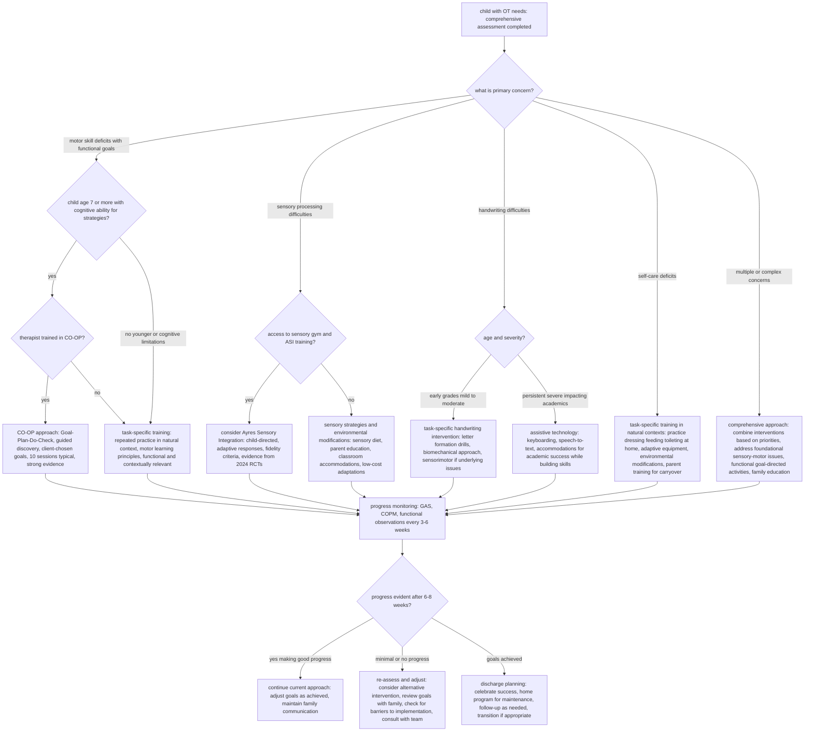

# Pediatric Occupational Therapy: Comprehensive Taxonomy, Evidence-Based Interventions, and Clinical Pathways

**For Children Ages 2-12 Years**
**Indian and Global Context**

---

## Table of Contents

1. [Executive Summary](#1-executive-summary)
2. [Introduction to Pediatric Occupational Therapy](#2-introduction-to-pediatric-occupational-therapy)
3. [Developmental Red Flags and Identification](#3-developmental-red-flags-and-identification)
4. [Common Pediatric OT Diagnoses: Prevalence and Characteristics](#4-common-pediatric-ot-diagnoses-prevalence-and-characteristics)
5. [Comprehensive Assessment Framework](#5-comprehensive-assessment-framework)
6. [Differential Diagnosis](#6-differential-diagnosis)
7. [Evidence-Based Interventions](#7-evidence-based-interventions)
8. [Outcome Measurement](#8-outcome-measurement)
9. [Indian OT Training Pathway](#9-indian-ot-training-pathway)
10. [Clinical Decision-Making Framework](#10-clinical-decision-making-framework)
11. [Interactive Diagrams](#11-interactive-diagrams)
12. [References and Resources](#12-references-and-resources)

---

## 1. Executive Summary

Pediatric occupational therapy addresses children's ability to participate in meaningful daily activities (occupations) across home, school, and community settings. This comprehensive guide synthesizes current evidence-based practices (2020-2025) for children ages 2-12 years, with specific attention to the Indian context.

### Key Statistics

- **Developmental Coordination Disorder (DCD)**: 5-6% of school-aged children globally
- **Autism Spectrum Disorder (ASD)**:
  - India: 1 in 100 children (estimated 2-3 million children)
  - Global: 1 in 160 children (WHO)
- **ADHD**:
  - India: 11.32% prevalence in school-aged children
  - Global: 5-7% of children
- **Sensory Processing Disorder (SPD)**:
  - 45% of children with DCD show atypical sensory processing
  - 85.2% of children with ADHD show sensory processing differences
  - 16% of typically developing children show sensory sensitivities

### Core Intervention Approaches

1. **Ayres Sensory Integration (ASI)**: Strong evidence for sensory processing difficulties
2. **Cognitive Orientation to daily Occupational Performance (CO-OP)**: Effective for DCD, cerebral palsy, spina bifida
3. **Task-Specific Training**: Goal-directed, occupation-based interventions
4. **Environmental Modifications**: Contextual adaptations for participation

---

## 2. Introduction to Pediatric Occupational Therapy

### 2.1 What is Occupational Therapy?

Occupational therapy (OT) is a client-centered health profession concerned with promoting health and wellbeing through occupation. For children, occupations include:

- **Self-care**: Dressing, feeding, bathing, toileting
- **Productivity**: School tasks, homework, household chores
- **Play and Leisure**: Social play, sports, hobbies, creative activities
- **Rest and Sleep**: Sleep routines, bedtime behaviors
- **Social Participation**: Peer interactions, family activities, community involvement

### 2.2 Scope of Pediatric OT Practice

Pediatric occupational therapists work with children who have:

1. **Neurodevelopmental disorders**: Autism spectrum disorder, ADHD, cerebral palsy, developmental coordination disorder
2. **Sensory processing difficulties**: Over-responsivity, under-responsivity, sensory seeking
3. **Learning disabilities**: Dysgraphia, visual-motor integration deficits
4. **Physical disabilities**: Congenital abnormalities, acquired injuries
5. **Mental health conditions**: Anxiety, trauma-related difficulties
6. **Genetic conditions**: Down syndrome, fragile X syndrome

### 2.3 Indian Context for Pediatric OT

**Unique Considerations:**

- **Limited awareness**: OT is less known than physiotherapy or speech therapy in India
- **Resource constraints**: Shortage of pediatric OTs, especially in rural areas
- **Cultural factors**: Joint family systems, educational pressures, stigma around disabilities
- **Infrastructure gaps**: Limited sensory integration equipment in clinics
- **Multilingual assessment needs**: Adapting standardized tools for regional languages
- **School integration challenges**: Lack of special education resources in mainstream schools

**Indian OT Workforce:**

- Approximately 5,000 registered occupational therapists in India (RCI data)
- Ratio: ~1 OT per 250,000 population (severely inadequate)
- Concentration in urban centers: Delhi, Mumbai, Bangalore, Chennai, Hyderabad
- Growing telepractice adoption post-COVID-19

---

## 3. Developmental Red Flags and Identification

### 3.1 Red Flags by Age Group

#### Ages 2-3 Years

**Motor Concerns:**
- Not walking independently by 18 months
- Frequent falling or clumsiness beyond typical toddler behavior
- Not climbing stairs by 24 months
- Still using fisted grasp to hold crayon at 18 months
- Not using mature pincer grasp by 18 months
- Crawling in abnormal pattern (e.g., bottom-shuffling only, asymmetrical crawling)

**Self-Care Concerns:**
- Not self-feeding with utensils by 24 months
- No interest in attempting to dress self by age 3
- Extreme difficulty with transitions (meltdowns during routine changes)

**Play and Social Concerns:**
- Lack of pretend play by age 3
- Not imitating simple actions
- Not engaging in parallel play with peers
- Extreme sensory aversions (textures, sounds, movement)

**Communication and Cognitive:**
- Not using at least 6 words by 18 months
- Not using three-word sentences by 24 months
- Not imitating a drawing of vertical line by 24 months

#### Ages 3-5 Years

**Fine Motor Concerns:**
- Cannot copy a circle by age 3
- Cannot copy a cross by age 4
- Cannot draw a person with 3 body parts by age 5
- Difficulty with simple puzzles (3-4 pieces at age 3)
- Not isolating index finger for pointing or poking
- Excessively tight or loose pencil grasp

**Gross Motor Concerns:**
- Not jumping in place by age 3
- Not standing on one foot briefly by age 4
- Cannot skip or hop on one foot by age 5
- Avoids playground equipment
- Poor ball skills (cannot catch large ball by age 5)

**Self-Care and Independence:**
- Cannot use spoon and fork without significant spillage by age 4
- Not toilet trained by age 4 (developmental concern, rule out medical issues)
- Cannot put on simple clothing items by age 5
- Difficulty with buttons, zippers by age 5

**Behavioral and Sensory:**
- Unusually fearful, sad, shy, or angry
- Extremely picky eating (less than 10 foods accepted)
- Constant movement or extreme lethargy
- Aggressive behaviors without apparent cause
- Defensive responses to touch, grooming activities

**Social and Play:**
- Ignoring other children consistently
- No cooperative play by age 5
- Rigid, repetitive play patterns
- Difficulty following simple classroom routines

#### Ages 6-8 Years

**Academic and Fine Motor:**
- Illegible handwriting despite instruction
- Cannot copy from board efficiently
- Extreme fatigue during writing tasks
- Poor spacing, sizing, alignment of letters
- Cannot tie shoelaces by age 7
- Difficulty with scissors (cutting on lines)

**Gross Motor and Coordination:**
- Significant difficulty with bike riding by age 8
- Cannot catch or throw ball with peers
- Avoids PE class or sports
- Clumsy, bumps into things frequently
- Poor body awareness in space

**Executive Function and Organization:**
- Cannot organize desk, backpack independently
- Loses materials constantly
- Cannot complete multi-step tasks without constant prompting
- Difficulty with time concepts and transitions

**Social Participation:**
- Being labeled a "bad kid" due to behavioral difficulties
- Difficulty engaging with peers on playground
- Unable to participate in extracurricular activities due to skill or behavioral challenges
- Poor frustration tolerance affecting peer relationships

#### Ages 9-12 Years

**Participation Limitations:**
- Persistent handwriting difficulties impacting academic performance
- Social isolation due to motor skill differences
- Difficulty with age-appropriate self-care (e.g., showering, grooming)
- Cannot keep up with peers in sports or physical activities
- Organizational difficulties significantly impacting school performance

**Sensory and Regulatory:**
- Ongoing sensory sensitivities interfering with daily life
- Difficulty regulating emotions appropriately
- Sleep difficulties affecting daytime function
- Anxiety related to performance demands

### 3.2 Who Identifies?

**Primary Identifiers:**

1. **Parents/Caregivers (40-50% of referrals)**
   - Notice developmental delays
   - Compare to siblings or peers
   - Struggle with daily routines (dressing, feeding, behavior)

2. **Pediatricians (25-30% of referrals)**
   - Developmental screening at well-child visits
   - Use of standardized tools (Ages & Stages Questionnaire, M-CHAT for autism)
   - Medical red flags (hypotonia, asymmetry, delayed milestones)

3. **Teachers/School Staff (20-25% of referrals)**
   - Classroom observations
   - Handwriting difficulties
   - Behavioral challenges during transitions, sensory-rich environments
   - Social participation concerns

4. **Other Allied Professionals**
   - Speech-language pathologists (notice motor or sensory issues)
   - Physiotherapists (observe fine motor or coordination concerns)
   - Psychologists (identify sensory or motor components affecting behavior)

### 3.3 Referral Process in India

**Public Health System:**
- Primary Health Centers (PHCs): Limited OT availability
- District Early Intervention Centers (DEICs): Under RBSK program, some have OTs
- Tertiary hospitals: AIIMS, NIMHANS, PGIMER - comprehensive OT services

**Private Sector:**
- Private clinics and hospitals: More accessible in urban areas
- Special schools: Often employ OTs
- NGOs and charitable trusts: Subsidized services (e.g., Action for Autism, Tamana, NIEPMD)

**School-Based:**
- Limited in mainstream schools
- More common in special schools or inclusive education resource centers
- Growing trend: OT consultation for school modifications

**Insurance Coverage:**
- Limited coverage under standard health insurance
- Some coverage under disability insurance schemes
- CGHS and ECHS provide OT services at empaneled centers

---

## 4. Common Pediatric OT Diagnoses: Prevalence and Characteristics

### 4.1 Autism Spectrum Disorder (ASD)

**Prevalence:**
- **India**: 1 in 100 children (estimated 2-3 million children with autism)
- **Global**: 1 in 160 children (WHO); 1 in 36 in US (CDC 2023)
- **Gender ratio**: 4:1 male to female

**Core Characteristics Relevant to OT:**

1. **Sensory Processing Differences** (present in 90-95% of children with ASD)
   - Hyper-responsivity: Over-reaction to sounds, textures, lights
   - Hypo-responsivity: Under-reaction to pain, temperature, vestibular input
   - Sensory seeking: Craving intense sensory experiences
   - Difficulty with sensory modulation affecting participation

2. **Motor Difficulties**
   - Dyspraxia (motor planning difficulties) in 50-80%
   - Fine motor delays: Difficulty with handwriting, manipulation
   - Gross motor delays: Coordination, balance challenges
   - Repetitive motor behaviors (stimming)

3. **Self-Care Challenges**
   - Difficulty with dressing (buttons, zippers, laces)
   - Feeding: Extreme selectivity (often less than 10 foods), texture aversions
   - Toileting: Delayed training, sensory issues with bathrooms
   - Grooming: Resistance to hair washing, nail cutting, tooth brushing

4. **Play and Leisure**
   - Repetitive, restricted play patterns
   - Difficulty with imaginative play
   - Challenges with cooperative play and turn-taking
   - Narrow interests

**OT Goals for ASD:**
- Sensory regulation strategies
- Motor skill development
- Self-care independence
- Play skill expansion
- Participation in school and community activities

### 4.2 Attention-Deficit/Hyperactivity Disorder (ADHD)

**Prevalence:**
- **India**: 11.32% in school-aged children (pooled prevalence from Indian studies)
- **Global**: 5-7% of children
- **Gender ratio**: 2-3:1 male to female (may be underdiagnosed in females)

**Subtypes:**
1. Predominantly inattentive
2. Predominantly hyperactive-impulsive
3. Combined presentation (most common)

**OT-Relevant Characteristics:**

1. **Sensory Processing** (85.2% show sensory differences)
   - Sensory seeking behaviors
   - Difficulty filtering sensory information
   - Poor sensory modulation affecting attention

2. **Motor Skills**
   - Developmental Coordination Disorder co-occurs in 30-50%
   - Handwriting difficulties (dysgraphia)
   - Fidgeting, restlessness

3. **Executive Function Deficits**
   - Organization and planning
   - Time management
   - Working memory
   - Task initiation and completion

4. **Self-Regulation**
   - Emotional regulation difficulties
   - Impulse control challenges
   - Difficulty with transitions

**OT Goals for ADHD:**
- Sensory strategies for attention and regulation
- Organization and time management skills
- Fine motor and handwriting improvement
- Self-regulation strategies
- Environmental modifications for success

### 4.3 Developmental Coordination Disorder (DCD)

**Prevalence:**
- **Global**: 5-6% of school-aged children
- **India**: Limited epidemiological data; estimated similar to global rates
- **Gender ratio**: 2-4:1 male to female

**DSM-5 Diagnostic Criteria:**
1. Acquisition and execution of coordinated motor skills substantially below expected level for age
2. Motor skill deficits significantly interfere with activities of daily living
3. Onset in early developmental period
4. Not better explained by intellectual disability, visual impairment, or neurological condition

**Characteristics:**

1. **Gross Motor Difficulties**
   - Poor balance and coordination
   - Difficulty with sports, running, jumping
   - Clumsy, frequent falls
   - Difficulty learning new motor skills (e.g., bike riding)

2. **Fine Motor Challenges**
   - Handwriting difficulties (most common academic concern)
   - Difficulty with buttons, zippers, tying shoes
   - Poor pencil grasp and control
   - Challenges with cutting, drawing

3. **Motor Planning (Dyspraxia)**
   - Difficulty sequencing motor actions
   - Struggles with novel motor tasks
   - Poor body awareness

4. **Sensory Processing** (45% show atypical patterns)
   - Proprioceptive and vestibular processing differences
   - Tactile sensitivities

**Impact:**
- Academic difficulties (handwriting, PE participation)
- Social challenges (teasing, exclusion from play)
- Low self-esteem
- Risk for anxiety and depression
- Decreased physical activity leading to health issues

**OT Goals for DCD:**
- Task-specific motor skill training
- CO-OP approach for goal achievement
- Sensory integration therapy
- Environmental and task modifications
- Assistive technology (e.g., keyboarding, adapted tools)

### 4.4 Sensory Processing Disorder (SPD)

**Note**: Not a standalone diagnosis in DSM-5 or ICD-11; sensory symptoms listed as ASD criterion

**Prevalence:**
- **General population**: 5-16% of children show sensory processing difficulties
- **Clinical populations**: Much higher (45% DCD, 85% ADHD, 90-95% ASD)

**Subtypes (Miller et al., 2007):**

1. **Sensory Modulation Disorder**
   - **Over-Responsivity** (SOR): Exaggerated responses to sensory input
     - Examples: Distress with clothing tags, loud noises, light touch
     - Fight-or-flight responses to benign sensory input
   - **Under-Responsivity** (SUR): Diminished responses
     - Examples: High pain tolerance, doesn't notice when called
     - Appears withdrawn or difficult to engage
   - **Sensory Seeking**: Craving intense sensory experiences
     - Examples: Constant movement, crashing into things, chewing on objects

2. **Sensory-Based Motor Disorder**
   - **Dyspraxia**: Difficulty planning and executing motor actions
   - **Postural Disorder**: Poor core strength, balance, stability

3. **Sensory Discrimination Disorder**
   - Difficulty interpreting qualities of sensory input
   - Examples: Can't tell textures apart, poor spatial awareness, difficulty with force modulation

**Clinical Debate:**
- Some experts argue SPD diagnosis may lead to missed ASD or ADHD diagnoses
- Others advocate for SPD as distinct condition requiring specific treatment
- Consensus: Sensory issues warrant OT intervention regardless of diagnostic label

**OT Goals for SPD:**
- Sensory modulation strategies
- Sensory diet (planned sensory activities)
- Environmental modifications
- Education for parents and teachers
- Improving participation in daily activities

### 4.5 Cerebral Palsy (CP)

**Prevalence:**
- **India**: 2-3 per 1000 live births (higher due to perinatal care gaps)
- **Global**: 1.5-4 per 1000 live births
- Most common motor disability in childhood

**Types:**
- Spastic (70-80%): Increased muscle tone
- Dyskinetic (10-20%): Involuntary movements
- Ataxic (5-10%): Poor coordination and balance
- Mixed

**OT Focus:**
- Hand function and manipulation
- Self-care adaptations
- Positioning and seating
- Assistive technology
- Play and leisure participation
- CO-OP approach showing effectiveness

### 4.6 Down Syndrome

**Prevalence:**
- **India**: 1 in 800-1000 live births
- **Global**: 1 in 700-1000 live births

**OT Concerns:**
- Hypotonia (low muscle tone) affecting motor development
- Fine and gross motor delays
- Oral motor difficulties affecting feeding
- Self-care skill development
- Sensory processing variations
- Cognitive factors affecting motor learning

### 4.7 Learning Disabilities with Motor Components

**Dysgraphia (Writing Disorder):**
- Difficulty with handwriting legibility and/or speed
- Often co-occurs with dyslexia, ADHD, DCD
- Prevalence: 5-20% of school-aged children

**Visual-Motor Integration Deficits:**
- Difficulty integrating visual information with motor output
- Impacts handwriting, copying, math alignment
- Common in multiple neurodevelopmental conditions

---

## 5. Comprehensive Assessment Framework

### 5.1 Initial Evaluation Process

**1. Referral and Screening**
- Review referral information
- Parent questionnaires
- Screening tools to determine need for comprehensive assessment

**2. Case History**
- **Prenatal and birth history**: Complications, prematurity, birth weight
- **Developmental milestones**: Motor, communication, social, self-care
- **Medical history**: Diagnoses, medications, hospitalizations, surgeries
- **Family history**: Genetic conditions, developmental delays
- **Educational history**: School performance, supports in place
- **Daily routines**: Typical day, sleep, eating, play patterns
- **Indian context considerations**: Consanguinity, home environment, language(s) spoken

**3. Parent/Caregiver Concerns**
- Primary concerns and priorities
- Impact on family life
- Previous interventions and their effectiveness
- Cultural values and family goals

### 5.2 Standardized Assessment Tools

#### Sensory Processing Assessments

**1. Sensory Profile 2 (Birth-14+ years)**
- **Description**: Parent/caregiver questionnaire measuring sensory processing patterns
- **Domains**: Auditory, visual, tactile, movement, body position, oral, behavioral, emotional
- **Quadrants**: Seeking, avoiding, sensitivity, registration
- **Use in India**: Available; requires translation for non-English speakers
- **Interpretation**: Identifies sensory patterns affecting participation

**2. Sensory Processing Measure (SPM)**
- **Versions**: Home, main classroom, school environments
- **Ages**: 5-12 years
- **Use**: Comprehensive sensory assessment across contexts
- **Indian context**: Limited availability, English version primarily

**3. Evaluation in Ayres Sensory Integration (EASI)**
- **Description**: Observational tool for use with ASI
- **Requires**: Advanced ASI training
- **Use**: Clinical observation of sensory integration patterns
- **Availability in India**: Limited to ASI-certified therapists

#### Motor Assessments

**4. Movement Assessment Battery for Children - Second Edition (MABC-2)**
- **Ages**: 3-16 years
- **Domains**: Manual dexterity, aiming & catching, balance
- **Use**: Gold standard for identifying DCD
- **Indian context**: Available but expensive; limited normative data for Indian children
- **Interpretation**: Percentile scores; <15th percentile indicates motor difficulty

**5. Bruininks-Oseretsky Test of Motor Proficiency (BOT-2)**
- **Ages**: 4-21 years
- **Domains**: Fine motor precision, integration, manual dexterity, bilateral coordination, balance, running speed, upper-limb coordination, strength
- **Use**: Comprehensive motor assessment
- **Availability**: Limited in India due to cost

**6. Peabody Developmental Motor Scales - Second Edition (PDMS-2)**
- **Ages**: Birth-5 years
- **Domains**: Gross motor (reflexes, stationary, locomotion, object manipulation) and fine motor (grasping, visual-motor integration)
- **Use**: Early childhood motor development
- **Indian availability**: Available in some tertiary centers

#### Functional and Occupation-Based Assessments

**7. Canadian Occupational Performance Measure (COPM)**
- **Ages**: All ages (with appropriate cognitive level)
- **Description**: Semi-structured interview measuring client-identified performance and satisfaction
- **Domains**: Self-care, productivity, leisure
- **Use**: Goal-setting and outcome measurement
- **Advantages**: Client-centered, culturally adaptable
- **Indian context**: Widely used; easily adapted for cultural relevance

**8. Pediatric Evaluation of Disability Inventory (PEDI)**
- **Ages**: 6 months-7.5 years
- **Domains**: Self-care, mobility, social function
- **Versions**: PEDI-CAT (computer adaptive), standard
- **Use**: Measures functional capabilities and performance
- **Indian availability**: Growing use; CAT version less accessible

**9. WeeFIM (Functional Independence Measure for Children)**
- **Ages**: 6 months-7 years; 7-21 years (different versions)
- **Domains**: Self-care, sphincter control, transfers, locomotion, communication, social cognition
- **Use**: Measures independence in daily activities
- **Indian context**: Used in rehabilitation centers

**10. School Function Assessment (SFA)**
- **Ages**: Elementary school (Grades K-6)
- **Domains**: Participation, task supports, activity performance
- **Settings**: Regular and special education classrooms
- **Use**: Identifies supports needed for school participation
- **Indian applicability**: Can be adapted for Indian school contexts

#### Visual-Motor and Perceptual Assessments

**11. Beery-Buktenica Developmental Test of Visual-Motor Integration (Beery VMI)**
- **Ages**: 2-100 years
- **Description**: Copying geometric forms
- **Supplemental tests**: Visual perception, motor coordination
- **Use**: Identifies visual-motor integration difficulties affecting handwriting
- **Availability**: Widely available in India

**12. Test of Visual-Perceptual Skills (TVPS-4)**
- **Ages**: 5-21 years
- **Domains**: Visual discrimination, memory, spatial relations, form constancy, sequential memory, figure-ground, visual closure
- **Use**: Non-motor visual perception assessment
- **Indian use**: Available in urban centers

#### Handwriting Assessments

**13. Evaluation Tool of Children's Handwriting (ETCH)**
- **Ages**: Grades 1-6
- **Tasks**: Manuscript and cursive writing in various contexts
- **Use**: Identifies specific handwriting difficulties
- **Indian context**: May need adaptation for regional scripts

**14. Minnesota Handwriting Assessment (MHA)**
- **Ages**: Grades 1-3
- **Measures**: Legibility, speed, form, alignment, size, spacing
- **Use**: Quick screening of handwriting quality

#### Autism-Specific Assessments

**15. Childhood Autism Rating Scale - Second Edition (CARS-2)**
- **Ages**: 2+ years
- **Use**: Screening and severity rating for autism
- **Indian context**: Widely used; some translation available

#### Other Assessments

**16. Vineland Adaptive Behavior Scales - Third Edition**
- **Ages**: Birth-90 years
- **Domains**: Communication, daily living skills, socialization, motor skills
- **Use**: Comprehensive adaptive functioning
- **Indian use**: Available; cultural adaptation needed

**17. Executive Function Assessments**
- Behavior Rating Inventory of Executive Function (BRIEF)
- Ages: 5-18 years
- Parent and teacher versions
- Indian context: Available; useful for ADHD, ASD assessments

### 5.3 Clinical Observations

**Observational Areas:**

1. **Sensory Processing**
   - Responses to tactile, vestibular, proprioceptive, auditory, visual input
   - Sensory seeking or avoiding behaviors
   - Modulation during activities

2. **Motor Skills**
   - Muscle tone (hypotonia, hypertonia, typical)
   - Postural control and core strength
   - Bilateral coordination
   - Motor planning (praxis)
   - Fine motor precision and control
   - Gross motor coordination and balance

3. **Visual-Motor Integration**
   - Eye-hand coordination
   - Copying skills
   - Construction activities

4. **Play Skills**
   - Play types (sensorimotor, symbolic, constructive, games with rules)
   - Play complexity and creativity
   - Social play interactions

5. **Self-Regulation**
   - Attention and focus
   - Response to frustration
   - Transitions between activities
   - Arousal level (alertness)

6. **Social Interaction**
   - Eye contact
   - Joint attention
   - Turn-taking
   - Communication style

### 5.4 Contextual Assessment

**Home Environment:**
- Physical accessibility
- Sensory environment (noise, lighting, clutter)
- Cultural practices affecting occupations
- Family routines and expectations

**School Environment:**
- Classroom setup and sensory factors
- Academic demands and accommodations
- Social demands (recess, group work)
- Teacher understanding and support

**Community Participation:**
- Recreational activities
- Religious/cultural participation
- Transportation accessibility

### 5.5 Cultural Considerations in Assessment (Indian Context)

**Language:**
- Assess in child's primary language(s)
- Use interpreters when needed
- Consider multilingual development patterns

**Cultural Values:**
- Family structure (joint vs nuclear family)
- Academic expectations and pressure
- Gender role expectations
- Attitudes toward disability
- Traditional vs modern practices

**Adaptation of Standardized Tools:**
- Lack of Indian norms for many tests
- Cultural relevance of test items
- Consider using criterion-referenced over norm-referenced when appropriate

---

## 6. Differential Diagnosis

Differential diagnosis in pediatric OT involves distinguishing between conditions with overlapping symptoms to guide appropriate intervention.

### 6.1 Overlapping Presentations

**Common Challenge**: Children with autism share symptoms with those with other neurodevelopmental disorders (intellectual disability, communication disorders), making accurate diagnosis complex.

**Key Considerations:**
- Multiple diagnoses often co-occur
- Symptoms may overlap but require different intervention approaches
- Ongoing assessment may clarify diagnostic picture over time

### 6.2 Sensory Processing Patterns Across Diagnoses

| Diagnosis | Sensory Processing Patterns | Prevalence of Sensory Issues |
|-----------|----------------------------|------------------------------|
| **Autism Spectrum Disorder** | Hyper and hypo-responsivity, sensory seeking, modulation difficulties across all systems | 90-95% |
| **ADHD** | Sensory seeking, difficulty filtering sensory information, modulation challenges | 85.2% |
| **DCD** | Proprioceptive and vestibular processing differences, some tactile sensitivities | 45% |
| **Typically Developing** | Mild sensory preferences | 16-25.7% |

**Clinical Implication**: Sensory processing difficulties alone do not indicate a specific diagnosis; pattern analysis and comprehensive evaluation are essential.

### 6.3 Differential Diagnosis Decision Points

#### Sensory Processing Disorder vs. Autism vs. ADHD

**When Sensory Issues are Primary:**

| Feature | SPD (Standalone) | ASD with Sensory | ADHD with Sensory |
|---------|-----------------|------------------|-------------------|
| **Social Communication** | Typical development | Impaired (core feature) | Typical, but may struggle due to impulsivity |
| **Restricted/Repetitive Behaviors** | Minimal; sensory-driven | Present (core feature) | Minimal; may be fidgeting |
| **Attention** | May be affected by sensory input | Variable; often focused on restricted interests | Impaired (core feature) |
| **Response to Sensory Strategies** | Excellent; primary need | Helpful but not sufficient | Helpful for regulation |

**Important Consideration**: Some experts argue diagnosing SPD alone may cause ASD and ADHD to go undiagnosed. Always screen for core features of these conditions.

#### DCD vs. Dyspraxia vs. Autism with Motor Difficulties

| Feature | DCD | Dyspraxia (Motor Planning) | ASD with Motor Issues |
|---------|-----|---------------------------|----------------------|
| **Primary Deficit** | Coordination and skill acquisition | Motor planning and sequencing | Variable; often dyspraxia + coordination |
| **Social Communication** | Typical | Typical | Impaired |
| **Cognitive** | Typically average or above | Typically average or above | Variable |
| **Sensory** | 45% have sensory issues | Often present | 90-95% have sensory issues |
| **Response to Intervention** | Task-specific training, CO-OP effective | Motor planning strategies, CO-OP | Sensory-motor integration, visual supports |

**Note**: Dyspraxia and DCD often overlap; some use terms interchangeably while others see dyspraxia as motor planning subset of DCD.

#### ADHD vs. Sensory Seeking vs. Anxiety

**Child presents with constant movement, difficulty sitting still, appearing distracted:**

| Indicator | Suggests ADHD | Suggests Sensory Seeking | Suggests Anxiety |
|-----------|---------------|-------------------------|------------------|
| **Context** | Across all settings | Worse in under-stimulating environments | Worse in stressful/new situations |
| **Response to Movement** | May help briefly but difficulty persists | Helps significantly; seeks it out | May increase (appears more agitated) |
| **Focus when interested** | Can hyperfocus on preferred tasks | Variable | Variable; worry may interfere |
| **Sleep** | Often difficulty falling asleep | May sleep well if sensory needs met | Difficulty due to worry |
| **Social Relationships** | Impulsive, may dominate | Typical when sensory needs met | May avoid due to fear |

### 6.4 Co-Occurring Conditions

**Common Co-Occurrences:**

1. **DCD + ADHD**: 30-50% of children with ADHD have DCD
2. **ASD + ADHD**: 30-50% co-occurrence
3. **ASD + DCD**: 50-80% of children with ASD have motor difficulties
4. **Anxiety + any neurodevelopmental disorder**: High rates across all conditions

**Clinical Approach:**
- Assess for all areas of concern
- Prioritize intervention targets based on functional impact
- Recognize that treating one area (e.g., sensory) may improve another (e.g., attention)

### 6.5 When to Refer for Additional Evaluation

**Refer to developmental pediatrician/neurologist:**
- Suspected ASD, ADHD, or other neurodevelopmental diagnosis
- Regression of skills
- Seizures or neurological concerns
- Complex medical history

**Refer to psychologist:**
- Cognitive concerns (learning disabilities, intellectual disability)
- Mental health (anxiety, depression, trauma)
- Comprehensive behavioral assessment

**Refer to speech-language pathologist:**
- Communication delays or disorders
- Social communication concerns
- Feeding/swallowing difficulties

**Refer to physiotherapist:**
- Significant gross motor delays
- Abnormal muscle tone or movement patterns
- Neurological or orthopedic conditions

---

## 7. Evidence-Based Interventions

### 7.1 Ayres Sensory Integration (ASI)

**Theoretical Foundation:**
Developed by A. Jean Ayres, ASI theory posits that the brain's ability to organize and interpret sensory information is foundational for learning and behavior.

**Core Principles:**
1. Provides controlled sensory experiences
2. Child-directed, therapist-guided
3. Uses suspended equipment for vestibular and proprioceptive input
4. Adaptive responses to sensory challenges promote brain organization
5. Just-right challenge for intrinsic motivation

**Fidelity Criteria (Parham et al., 2011):**
To be considered true ASI, intervention must include:
- Provision of sensory opportunities (tactile, proprioceptive, vestibular)
- Therapist-child collaboration in activity choice
- Supporting the child's inner drive
- Promoting increasingly complex adaptive responses
- Ensuring physical safety
- Creating an optimal alliance with the child
- Creating a playful environment
- Modifying activity to maximize engagement
- Sensory-rich environment
- Facilitating self-organization

**Evidence Base (2024 Updates):**

1. **RCT for DCD (2024)**: Ayres Sensory Integration showed significant improvements in goal achievement and sensory processing in children with DCD compared to standard care. Effect sizes were moderate to large for individualized goals.

2. **Telehealth Adaptation (2024)**: ASI principles adapted for telehealth showed feasibility and positive outcomes, with parent coaching as key component. Particularly relevant for India's rural-urban divide.

3. **Meta-Analysis (2024)**: Sensory integration therapy demonstrated effectiveness for children with sensory processing difficulties, with stronger effects when using fidelity measures.

**Who Benefits from ASI:**
- Children with sensory processing difficulties (primary indication)
- Autism spectrum disorder with sensory features
- DCD with sensory components
- ADHD with sensory modulation concerns
- Regulatory disorders

**Limitations in India:**
- Requires specialized equipment (suspended equipment, crash mats)
- ASI certification training limited (expensive, often requires international travel)
- Few certified ASI therapists in India
- High cost of equipment

**Adaptations for Indian Context:**
- Low-cost alternatives (rope swings, household items)
- Community-based sensory gyms
- Group sensory motor programs
- Parent coaching models

### 7.2 Cognitive Orientation to daily Occupational Performance (CO-OP)

**Theoretical Foundation:**
CO-OP is a cognitively based, client-centered, performance-oriented intervention using problem-solving strategies and guided discovery to help children achieve functional goals.

**Core Features:**
1. **Top-down approach**: Focus on occupation (functional goals), not impairment
2. **Client-chosen goals**: Child and family select meaningful goals
3. **Cognitive strategy use**: Global strategy (Goal-Plan-Do-Check) + domain-specific strategies
4. **Guided discovery**: Therapist uses questions to help child discover solutions
5. **Dynamic performance analysis**: Identify performance breakdowns
6. **Parent/teacher involvement**: Transfer and generalization

**CO-OP Process (7-step framework):**

**Step 1: Goal Selection**
- Use COPM or similar to identify 3-5 functional goals
- Goals must be meaningful to child
- Specific, measurable, achievable

**Step 2: Cognitive Strategy Introduction**
- Teach global strategy: **Goal-Plan-Do-Check**
  - Goal: What do I want to do?
  - Plan: How am I going to do it?
  - Do: Carry out the plan
  - Check: Did my plan work?

**Step 3: Guided Discovery**
- Therapist uses questions, not instructions
- "What could you try?" vs "Try this"
- Child generates solutions with minimal cues

**Step 4: Dynamic Performance Analysis (DPA)**
- Identify specific performance breakdown
- Guide child to discover solution

**Step 5: Domain-Specific Strategy Use**
- Task analysis (breaking into steps)
- Body position (where should I be?)
- Attention to doing (focus on key aspects)
- Feeling the movement
- Verbal self-guidance

**Step 6: Parent/Teacher Involvement**
- Teach strategy use
- Support practice at home/school
- Promote generalization

**Step 7: Generalization**
- Apply strategies to new, untrained goals
- Transfer learning across contexts

**Evidence Base (2024):**

1. **CO-OP Superior to Standard Care (2022)**: For children with cerebral palsy and spina bifida, CO-OP led to greater goal achievement and transfer effects compared to ordinary treatment.

2. **Meta-Analysis (2022)**: CO-OP improves occupational performance in children with cerebral palsy, though not necessarily more than alternative interventions when compared head-to-head.

3. **Bibliometric Review (2024)**: Research on CO-OP has significantly increased, expanding from DCD to wider range of conditions including cerebral palsy, autism, developmental disabilities.

4. **Parental Coaching RCT (2021)**: CO-OP with parental coaching showed greater activity and participation improvements compared to CO-OP alone for children with DCD.

**Who Benefits from CO-OP:**
- DCD (strongest evidence)
- Cerebral palsy (growing evidence)
- Spina bifida
- Autism spectrum disorder (emerging evidence)
- Brain injury
- Children ages 7+ (requires cognitive understanding of strategy use)

**Advantages:**
- Client-centered, occupation-focused
- Transferable strategies
- Parental involvement
- Can be delivered in natural environments
- Cost-effective (typically 10 sessions)

**Limitations:**
- Requires cognitive ability to use strategies (typically ages 7+)
- May be less effective for children with significant intellectual disability
- Requires therapist training in CO-OP approach

**Indian Context:**
- Growing awareness and training opportunities
- Well-suited for school-based intervention
- Family involvement aligns with cultural values
- Can be adapted for group delivery to increase access

### 7.3 Task-Specific Training

**Approach:**
Repeated practice of specific functional tasks in natural contexts with feedback and grading of difficulty.

**Principles:**
- Practice tasks in context where they're needed
- High repetition (massed practice)
- Variable practice (different contexts)
- Feedback on performance
- Gradual increase in difficulty

**Examples:**
- Handwriting practice with specific letter formation drills
- Shoe-tying practice with increasing independence
- Cutting skills practice with graded materials

**Evidence:**
- Effective for skill acquisition in DCD
- Combined with motor learning principles enhances outcomes
- Functional, contextually relevant

**When to Use:**
- Clear, specific skill deficit
- Child motivated to improve specific task
- Younger children (less cognitive demand than CO-OP)
- Can complement other approaches

### 7.4 Strength and Conditioning Programs

**Approach:**
Structured exercise programs to improve strength, endurance, balance, coordination.

**Examples:**
- Core strengthening exercises
- Animal walks (bear walk, crab walk)
- Yoga for children
- Sports-based conditioning

**Evidence:**
- Improves motor performance in DCD
- Benefits children with cerebral palsy, Down syndrome
- May improve self-esteem and participation

**Indian Context:**
- Yoga widely accepted and accessible
- Can be delivered in schools or community settings
- Low cost

### 7.5 Environmental Modifications and Assistive Technology

**Principle:**
Change the environment or provide tools to enable participation without changing the person.

**Examples:**

**School Modifications:**
- Preferential seating (front, away from distractions)
- Reduced visual clutter
- Sensory tools (fidgets, wiggle cushions, weighted lap pads)
- Modified handwriting expectations
- Extra time for tasks
- Assistive technology (slant boards, pencil grips, keyboarding)

**Home Modifications:**
- Visual schedules for routines
- Labeled storage for organization
- Quiet spaces for regulation
- Adaptive equipment (built-up utensils, button hooks)

**Sensory Modifications:**
- Noise-reducing headphones
- Adjusted lighting
- Compression clothing
- Chewable jewelry for oral seekers

**Evidence:**
- Environmental modifications are evidence-based best practice
- Reduces barriers to participation
- Cost-effective
- Empowering for families

**Indian Considerations:**
- Low-cost adaptations using local materials
- Training teachers in simple modifications
- Accessible technology options (tablets for keyboarding)

### 7.6 Sensory Diets

**Definition:**
A planned and scheduled activity program designed to meet a child's specific sensory needs.

**Components:**
- Alerting activities (proprioceptive input, vestibular, cold)
- Organizing activities (heavy work, rhythmic movement)
- Calming activities (slow rocking, deep pressure, dim lighting)

**Examples:**
- Morning: Jumping on trampoline, pushing/pulling heavy cart
- Midday: Chair push-ups, carrying books
- Evening: Calming bath routine, deep pressure massage

**Implementation:**
- Assess sensory needs throughout day
- Schedule sensory input proactively (before challenging activities)
- Monitor effectiveness and adjust
- Educate parents, teachers on implementation

**Evidence:**
- Limited high-quality research on sensory diets specifically
- Clinical consensus supports use as part of comprehensive approach
- More effective when individualized and monitored

### 7.7 Social Skills Training

**OT Role in Social Skills:**
While often led by psychologists or speech therapists, OTs contribute by addressing:
- Sensory-motor foundations of social participation
- Play skills development
- Environmental modifications for social success
- Perspective-taking through joint activities

**Approaches:**
- Social stories
- Video modeling
- Peer-mediated interventions
- Structured play groups

**Evidence:**
- Effective for children with ASD, ADHD, social communication difficulties
- Best when combined with naturalistic practice opportunities

### 7.8 Handwriting Interventions

**Approaches:**

1. **Biomechanical/Motor Learning**
   - Correct pencil grasp
   - Posture and positioning
   - Letter formation drills
   - Size and spacing practice

2. **Sensorimotor Approach**
   - Fine motor strengthening
   - In-hand manipulation
   - Sensory awareness of hand

3. **Cognitive Approaches**
   - Visual-motor integration activities
   - Memory for letter forms
   - Self-monitoring strategies

4. **Assistive Technology**
   - Keyboarding
   - Speech-to-text
   - Pencil grips, adapted paper

**Evidence:**
- Task-specific handwriting practice more effective than general fine motor activities
- Pencil grips, slant boards, raised line paper can improve legibility
- Sensorimotor interventions benefit children with underlying sensory-motor issues
- Keyboarding is viable alternative for children with persistent difficulties

**Indian Context:**
- Consider regional scripts (Devanagari, Tamil, etc.)
- High academic pressure may necessitate AT sooner
- Cursive vs manuscript considerations

### 7.9 Parent and Teacher Education

**Critical Component:**
OT interventions are most effective when strategies are carried over into daily routines.

**Parent Coaching:**
- Teach "why" behind strategies (understanding child's needs)
- Model techniques
- Practice with feedback
- Problem-solve barriers to implementation
- Celebrate successes

**Teacher Consultation:**
- Classroom observations
- Individualized recommendations
- In-service training on sensory, motor, organizational strategies
- Collaboration on IEP/accommodations

**Evidence:**
- Parent involvement enhances outcomes across interventions
- Teacher implementation of strategies improves school participation
- Coaching models are effective and cost-efficient

**Indian Context:**
- Large class sizes challenge individualized attention
- Teacher training in special needs often limited
- Parent coaching particularly valuable given family involvement culture

---

## 8. Outcome Measurement

### 8.1 Importance of Outcome Measurement

**Why Measure Outcomes?**
- Demonstrate effectiveness of intervention
- Track child's progress toward goals
- Adjust intervention when progress is insufficient
- Justify continued services
- Contribute to evidence base

### 8.2 Goal Attainment Scaling (GAS)

**Description:**
Individualized outcome measure where goals are set and scaled to calculate extent of goal achievement.

**5-Point Scale:**
- **+2**: Much more than expected
- **+1**: Somewhat more than expected
- **0**: Expected level achieved
- **-1**: Somewhat less than expected
- **-2**: Much less than expected (current baseline)

**Example Goal:**

*Goal: Aditya will independently put on his school shirt*

- **-2** (Baseline): Aditya requires full physical assistance to put on shirt
- **-1**: Aditya puts arms through sleeves with physical prompts for each step
- **0** (Expected): Aditya independently puts on shirt with verbal reminders to button
- **+1**: Aditya independently puts on shirt and buttons 3/5 buttons without reminders
- **+2**: Aditya independently puts on and buttons shirt completely

**Advantages:**
- Individualized to child and family priorities
- Sensitive to meaningful change
- Can be used with any diagnosis or age
- Culturally adaptable

**Evidence:**
- Responsive measure of functional change in pediatric OT
- Valid for school-based and clinic-based settings
- Widely used in research (CO-OP, ASI, pediatric CP studies)
- Recommended for use with ICF-CY framework

**Use in India:**
- No language or cultural barriers
- Suitable for diverse goals (self-care, school, cultural/religious activities)
- Free, no equipment needed

### 8.3 Canadian Occupational Performance Measure (COPM)

**Description:**
Semi-structured interview measuring client-perceived performance and satisfaction in self-identified occupations.

**Process:**
1. Identify occupational performance problems across self-care, productivity, leisure
2. Client rates importance of each problem
3. Select up to 5 most important problems
4. Rate current performance (1-10 scale)
5. Rate current satisfaction (1-10 scale)
6. Re-administer after intervention to measure change

**Scoring:**
- Clinically significant change: 2+ point improvement in performance or satisfaction
- Can calculate total scores (average of ratings)

**Advantages:**
- Client-centered
- Captures what matters to child and family
- Detects meaningful change
- Quick to administer (20-40 minutes)

**Evidence:**
- Widely used in pediatric OT research
- Valid and reliable for children when developmentally appropriate
- Sensitive to change following intervention

**Considerations for Children:**
- Younger children may need parent as primary respondent
- Older children/teens can self-report with support
- Can use pictures or activity cards to facilitate identification

### 8.4 Standardized Assessment Re-Administration

**Approach:**
Re-administer standardized assessments (e.g., MABC-2, Sensory Profile, BOT-2) after intervention period to measure change.

**Advantages:**
- Objective, norm-referenced data
- Can compare to same-age peers
- Useful for research and demonstrating outcomes

**Limitations:**
- May not capture meaningful functional change
- Test-retest effects
- Expensive and time-consuming
- Standardized tools may not be sensitive to individual goals

**When to Use:**
- Research contexts
- When diagnosis clarification needed
- Insurance or institutional requirements
- Alongside functional measures (GAS, COPM)

### 8.5 Functional Performance Measures

**Pediatric Evaluation of Disability Inventory (PEDI/PEDI-CAT):**
- Measures capability and performance in self-care, mobility, social function
- Sensitive to change over time
- Normative data available

**WeeFIM:**
- Measures independence in daily activities
- Used in rehabilitation settings
- Tracks progress toward independence

**School Function Assessment (SFA):**
- Participation, task supports, activity performance in school
- Identifies areas needing accommodation
- Useful for school-based OT

### 8.6 Observational Measures

**Play Assessments:**
- Test of Playfulness (ToP)
- Revised Knox Preschool Play Scale
- Observe play complexity, social interaction, creativity

**Behavioral Observations:**
- Frequency of target behaviors (e.g., remaining seated, task completion)
- Duration of engagement
- Quality of participation

### 8.7 Parent/Teacher Report

**Questionnaires:**
- Parent satisfaction surveys
- Teacher report of classroom functioning
- Behavior rating scales (e.g., BRIEF for executive function)

**Advantages:**
- Captures functioning in natural contexts
- Multiple perspectives
- Can track generalization

### 8.8 Outcome Measurement Best Practices

**Recommendations:**
1. **Use multiple measures**: Combine standardized, functional, and client-centered measures
2. **Measure what matters**: Align outcomes with intervention goals and family priorities
3. **Baseline and progress monitoring**: Assess before intervention and at regular intervals
4. **Involve families**: Share results and collaborate on adjustments
5. **Consider context**: Indian families may value certain outcomes (academic success, cultural participation) - ensure measurement reflects this

---

## 9. Indian OT Training Pathway

### 9.1 Entry Requirements

**High School (10+2):**
- Science stream (PCB - Physics, Chemistry, Biology)
- Minimum 50-60% aggregate (varies by institution)
- English proficiency

**Entrance Exams:**
- **AIISH (All India Institute of Speech and Hearing)**: Institution-specific entrance exam
- **NEET**: Some institutions accept NEET scores
- **State-level exams**: Various states have their own entrance processes
- **Institution-specific exams**: Private colleges may have their own admissions tests

### 9.2 Bachelor of Occupational Therapy (BOT)

**Duration:** 4.5 years
- 4 years academic and clinical training
- 6 months compulsory rotating internship

**Curriculum Overview:**

**Year 1: Foundation Sciences**
- Anatomy
- Physiology
- Biochemistry
- Psychology
- Sociology
- Introduction to Occupational Therapy
- Basic OT skills and activities
- Communication skills

**Year 2: Pathology and Core OT Principles**
- Pathology and Microbiology
- Pharmacology
- General Medicine and Surgery
- Psychiatry basics
- Orthopedics
- Neurology
- Occupational Therapy in Physical Dysfunction
- Occupational Therapy in Psychosocial Dysfunction
- Occupational Therapy in Pediatrics (introduction)
- Activity Analysis and Adaptation
- Clinical observation begins

**Year 3: Advanced OT Practice**
- Pediatric Occupational Therapy (in-depth)
  - Developmental disorders
  - Cerebral palsy
  - Autism spectrum disorder
  - Learning disabilities
  - Sensory integration theory and practice
- Neurological Occupational Therapy
  - Stroke, TBI, spinal cord injury
  - Progressive neurological conditions
- Orthopedic and Hand Therapy
- Community Based Rehabilitation (CBR)
- Rehabilitation Engineering and Assistive Technology
- Research Methodology
- Clinical fieldwork (longer placements)

**Year 4: Specialization and Integration**
- Advanced Pediatric OT
- Geriatric OT
- Hand Therapy
- Vocational Rehabilitation
- Administration and Management
- Professional Ethics and Practice
- Research Project
- Extended clinical placements

**6-Month Internship (after Year 4):**
- Rotations through:
  - Physical dysfunction
  - Psychosocial dysfunction
  - Pediatrics
  - Community-based rehabilitation
- Supervised clinical practice
- Typically 8-12 week rotations in each area
- Completes degree requirements

### 9.3 Institutions Offering BOT in India

**Government Institutions:**
1. **All India Institute of Speech and Hearing (AIISH), Mysore** - Premier institution
2. **National Institute for Empowerment of Persons with Multiple Disabilities (NIEPMD), Chennai**
3. **Pt. Deendayal Upadhyaya Institute for the Physically Handicapped, Delhi**
4. **Ali Yavar Jung National Institute of Speech and Hearing Disabilities (AYJNISHD), Mumbai**
5. **Swami Vivekanand National Institute of Rehabilitation Training and Research (SVNIRTAR), Cuttack**

**Private/Deemed Universities:**
1. Manipal Academy of Higher Education, Manipal
2. JSS Academy of Higher Education and Research, Mysore
3. Tamil Nadu Dr. M.G.R. Medical University, Chennai
4. Amrita Vishwa Vidyapeetham, Kochi
5. Christian Medical College (CMC), Vellore
6. King George's Medical University, Lucknow
7. Many others across India

### 9.4 Registration and Licensure

**Rehabilitation Council of India (RCI) Registration:**
- **Mandatory** for practice as occupational therapist in India
- Apply after completing BOT + internship
- Submit degree, internship completion certificate, other documents
- Registration fee required
- Certificate valid for 5 years, renewable
- **Without RCI registration, cannot legally practice OT in India**

**State Registration:**
- Some states have additional registration requirements
- Check with State Paramedical Council

### 9.5 Post-Graduate Education

**Master of Occupational Therapy (MOT):**
- **Duration**: 2 years
- **Eligibility**: BOT with RCI registration, often clinical experience preferred
- **Specializations**:
  - Pediatrics
  - Neurosciences
  - Musculoskeletal and Sports
  - Psychiatry
  - Community-Based Rehabilitation
  - Hand and Upper Extremity

**Institutions Offering MOT:**
- Manipal Academy, Manipal
- JSS University, Mysore
- AIISH, Mysore (limited seats)
- Tamil Nadu Dr. M.G.R. Medical University
- Others

**Master's Curriculum (Pediatric OT Example):**

**Year 1:**
- Advanced pediatric conditions
- Evidence-based practice in pediatrics
- Advanced assessment and evaluation
- Research methodology
- Clinical specialization practicum
- Electives (e.g., sensory integration, assistive technology)

**Year 2:**
- Dissertation/thesis
- Advanced clinical internships
- Specialized interventions (ASI, CO-OP, feeding therapy)
- Professional development and leadership

### 9.6 Doctoral Education

**Ph.D. in Rehabilitation Sciences/Occupational Therapy:**
- **Duration**: 3-5 years
- **Eligibility**: Master's degree, often with qualifying exam
- **Focus**: Research, academia, specialized clinical expertise
- Limited programs in India; some pursue Ph.D. abroad

**Institutions:**
- Manipal Academy
- JSS University
- Some medical universities

### 9.7 Continuing Professional Development

**Importance:**
- OT is an evolving field
- New evidence emerges constantly
- RCI may require continuing education for renewal (policies evolving)

**Opportunities:**
- **Indian Association of Occupational Therapists (IAOT)**: Annual conferences, workshops
- **World Federation of Occupational Therapists (WFOT)**: International conferences, resources
- **Online courses**: Sensory integration courses, CO-OP training, feeding therapy
- **Certifications**:
  - Ayres Sensory Integration Certification (USC/WPS - expensive, often pursued abroad or online)
  - CO-OP Academy training
  - Feeding therapy (SOS Approach, etc.)
  - NDT/Bobath
  - Hand therapy (CHT - international certification)

**Challenges in India:**
- Limited local advanced training opportunities
- Cost of international training prohibitive
- Need for more Indian faculty with advanced certifications to train locally

### 9.8 Career Pathways

**Clinical Practice:**
- Hospitals (government and private)
- Rehabilitation centers
- Special schools
- Clinics (employed or private practice)
- Home-based services
- Teletherapy providers (growing)

**Community and Public Health:**
- Community-Based Rehabilitation (CBR) programs
- NGOs working with disabilities
- Early intervention programs
- School-based services

**Academia and Research:**
- Teaching in BOT/MOT programs (requires Master's/Ph.D.)
- Clinical supervision
- Research positions

**Industry and Consulting:**
- Assistive technology companies
- Accessibility consulting
- Ergonomics and workplace health
- Product development (adaptive equipment)

**Typical Career Timeline:**

- **Years 0-2 post-BOT**: Entry-level clinician, diverse experience
- **Years 2-5**: Develop area of interest, may pursue MOT
- **Years 5-10**: Specialist clinician, potentially supervisory roles
- **Years 10+**: Senior clinician, private practice, consultation, academia

---

## 10. Clinical Decision-Making Framework

### 10.1 Evidence-Based Practice (EBP) in Pediatric OT

**Definition:**
Clinical decision-making that integrates:
1. **Best available research evidence**
2. **Clinical expertise and reasoning**
3. **Client needs, values, and context**

**EBP Process:**

**Step 1: Ask a Clinical Question**
- Use PICO format:
  - **P**opulation: Children with DCD ages 6-10
  - **I**ntervention: CO-OP approach
  - **C**omparison: Standard OT
  - **O**utcome: Functional goal achievement

**Step 2: Search for Evidence**
- Databases: PubMed, OTseeker, CINAHL, Cochrane
- Evidence pyramid: Systematic reviews > RCTs > cohort studies > case studies > expert opinion

**Step 3: Appraise the Evidence**
- Quality of study design
- Relevance to your client
- Applicability in your setting (especially Indian context)

**Step 4: Integrate with Clinical Expertise and Client Values**
- Does research align with what you've observed clinically?
- What does the family prioritize?
- What resources are available?

**Step 5: Implement**
- Select intervention approach
- Collaborate with family on goals
- Monitor progress

**Step 6: Evaluate Outcomes**
- Did intervention work for this child?
- Adjust if needed
- Contribute to evidence base

### 10.2 Clinical Reasoning in Pediatric OT

**Types of Clinical Reasoning:**

**1. Procedural Reasoning** (Scientific reasoning)
- What is the diagnosis/condition?
- What impairments are present?
- What interventions does evidence support?
- Example: Child has DCD, evidence supports CO-OP, therefore use CO-OP

**2. Interactive Reasoning** (Relationship-focused)
- Understanding child's perspective
- Building therapeutic relationship
- Motivating child
- Example: Child loves superheroes, frame intervention using superhero themes

**3. Conditional Reasoning** (Contextual/holistic)
- Considering whole child in context
- How does condition affect child's life?
- What is child's potential?
- Example: Child's school has no OT support, need to train teacher and provide home program

**4. Narrative Reasoning** (Story-making)
- Understanding child's story
- Envisioning future possibilities
- Example: Child struggling in school now, but with intervention, can participate with peers

**5. Pragmatic Reasoning** (Practical constraints)
- Time, resources, reimbursement
- Therapist's skills and training
- Equipment availability
- Example: Clinic lacks sensory gym equipment, adapt using low-cost alternatives

### 10.3 Factors Affecting Clinical Decision-Making

**Research from India and globally identifies:**

**Client Factors:**
- Knowledge and situation of the client
- Severity and complexity of condition
- Family priorities and resources
- Cultural beliefs and practices

**Therapist Factors:**
- Clinical experience and expertise
- Training and certifications
- Personal attitudes and biases
- Self-awareness and reflective practice

**Workplace Conditions:**
- Access to resources and equipment
- Time constraints
- Institutional policies
- Interprofessional collaboration opportunities

**Societal Attitudes:**
- Cultural attitudes toward disability
- Awareness and acceptance of OT
- Stigma and discrimination
- Educational system inclusion

### 10.4 Shared Decision-Making

**Importance:**
Sharing information and decisions with children and families is critical in pediatric rehabilitation. Ethical significance and clinical benefits are established.

**Process:**

**1. Information Exchange**
- Explain assessment findings in understandable terms
- Discuss evidence for intervention options
- Share what to expect (time, effort, outcomes)

**2. Deliberation**
- Explore family's values and priorities
- Discuss pros/cons of options
- Consider child's preferences (when developmentally appropriate)

**3. Decision**
- Collaborative choice of intervention approach
- Agreement on goals
- Plan for monitoring and adjusting

**Child Participation:**
- Even young children can participate (choice of activities, toy preferences)
- Older children/teens should be central to decision-making
- Respect child's autonomy while supporting informed choices

**Indian Context Considerations:**
- Family decision-making often involves extended family
- Respect for elders may influence process
- Father or grandfather may be primary decision-maker in some families
- Balance cultural norms with child's rights and best interests

### 10.5 Ethical Considerations

**Professional Ethics:**
- Beneficence: Act in child's best interest
- Non-maleficence: Do no harm
- Autonomy: Respect child and family choices
- Justice: Equitable access to services
- Confidentiality: Protect child's information

**Common Ethical Dilemmas:**

**1. Scope of Practice**
- Practicing within competence
- Seeking supervision/consultation when needed
- Referring when beyond scope

**2. Cultural Competence**
- Respecting diverse practices while advocating for child
- Navigating disagreements about intervention approaches
- Avoiding imposing Western values

**3. Resource Allocation**
- Limited therapy slots, how to prioritize?
- Balancing individual needs with program constraints
- Advocating for systemic change

**4. Informed Consent**
- Ensuring families truly understand
- Language barriers
- Literacy levels

### 10.6 Clinical Decision Tree: Which Intervention Approach?

**Initial Assessment Completed → Key Decision Points:**

**Decision Point 1: What is the Primary Concern?**

- **Sensory processing difficulties** → Consider ASI if:
  - Child has significant sensory modulation challenges
  - Impacting participation across settings
  - Access to sensory gym or adaptable space
  - Therapist has ASI training
  - If ASI not available: Sensory strategies, environmental modifications, parent education

- **Motor skill deficits (functional goals)** → Consider CO-OP if:
  - Child age 7+ with cognitive ability for strategy use
  - Specific functional goals identified
  - Child motivated to work on goals
  - Therapist trained in CO-OP
  - If CO-OP not suitable: Task-specific training, motor learning approaches

- **Handwriting difficulties** → Consider:
  - Age and grade level (early intervention vs compensation)
  - Underlying factors (visual-motor, motor control, sensory, attention)
  - Task-specific handwriting intervention
  - Assistive technology if persistent/severe
  - Accommodations for academic success during intervention

- **Self-care deficits** → Consider:
  - Task-specific training in natural contexts
  - Adaptive equipment
  - Environmental modifications
  - Parent training for carryover

**Decision Point 2: What Resources are Available?**

- **Well-equipped clinic with sensory gym** → ASI is option
- **School-based with limited equipment** → CO-OP, task-specific, consultation model
- **Telehealth** → Parent coaching, CO-OP (adapted), environmental modifications
- **Home-based** → Functional, context-based interventions, caregiver training

**Decision Point 3: What Does the Family Prioritize?**

- **Academic success** → Handwriting, attention strategies, organizational skills
- **Independence in daily living** → Self-care training, adaptive equipment
- **Social participation** → Play skills, sensory strategies, environmental supports
- **Cultural/religious participation** → Specific task training, family education

**Decision Point 4: Monitor and Adjust**

- **Progress evident** → Continue current approach
- **Minimal progress after 6-8 weeks** → Re-assess, consider alternative approach
- **New concerns emerge** → Adjust intervention plan
- **Goals achieved** → Generalization, new goals, or discharge

---

## 11. Interactive Diagrams

### 11.1 Comprehensive Pediatric OT Pathway

```mermaid
graph TD
    A[child with developmental or participation challenges ages 2-12 years] --> B[identification and referral]
    A --> C[comprehensive OT assessment]
    A --> D[diagnosis and classification]
    A --> E[intervention planning]
    A --> F[intervention delivery]
    A --> G[outcome measurement and progress monitoring]

    B --> B1[who identifies?]
    B1 --> B1a[parents: notice developmental delays or struggles with daily activities]
    B1 --> B1b[pediatricians: developmental screening and medical red flags]
    B1 --> B1c[teachers: classroom observations, handwriting, behavior concerns]
    B1 --> B1d[other allied professionals: speech therapists, physiotherapists, psychologists]

    B --> B2[red flags by age]
    B2 --> B2a[ages 2-3: not walking by 18 months, no words, no pretend play, fisted grasp at 18 months]
    B2 --> B2b[ages 3-5: can't copy circle by 3, not jumping, ignoring peers, extreme sensory aversions]
    B2 --> B2c[ages 6-8: illegible handwriting despite instruction, can't tie shoes by 7, labeled bad kid]
    B2 --> B2d[ages 9-12: persistent handwriting issues, social isolation, organizational difficulties]

    B --> B3[referral pathways in India]
    B3 --> B3a[public: PHCs, DEICs, tertiary hospitals like AIIMS NIMHANS]
    B3 --> B3b[private: clinics and hospitals in urban areas]
    B3 --> B3c[schools: special schools often have OTs, limited in mainstream]
    B3 --> B3d[NGOs: subsidized services like Action for Autism, Tamana]

    C --> C1[case history]
    C1 --> C1a[prenatal and birth: complications, prematurity, birth weight]
    C1 --> C1b[developmental milestones: motor, communication, social, self-care]
    C1 --> C1c[medical history: diagnoses, medications, surgeries]
    C1 --> C1d[family history: genetic conditions, consanguinity in Indian context]
    C1 --> C1e[education: school performance, supports in place]
    C1 --> C1f[daily routines: typical day, sleep, eating, play, cultural practices]

    C --> C2[standardized assessments]
    C2 --> C2a[sensory: Sensory Profile 2, SPM, EASI for ASI]
    C2 --> C2b[motor: MABC-2 gold standard for DCD, BOT-2, PDMS-2 for early childhood]
    C2 --> C2c[functional: COPM client-centered, PEDI, WeeFIM, SFA for school]
    C2 --> C2d[visual-motor: Beery VMI, TVPS-4 non-motor visual perception]
    C2 --> C2e[handwriting: ETCH, MHA for legibility and speed]
    C2 --> C2f[autism: CARS-2 screening and severity]
    C2 --> C2g[executive function: BRIEF for ADHD and ASD]

    C --> C3[clinical observations]
    C3 --> C3a[sensory processing: responses to input, seeking or avoiding behaviors]
    C3 --> C3b[motor: muscle tone, postural control, bilateral coordination, praxis]
    C3 --> C3c[visual-motor: eye-hand coordination, copying, construction]
    C3 --> C3d[play: sensorimotor, symbolic, constructive, games with rules, social interaction]
    C3 --> C3e[self-regulation: attention, frustration tolerance, transitions, arousal]

    C --> C4[contextual assessment]
    C4 --> C4a[home: accessibility, sensory environment, cultural practices, family routines]
    C4 --> C4b[school: classroom setup, academic demands, social demands, teacher support]
    C4 --> C4c[community: recreational activities, religious participation, transportation]

    D --> D1[common diagnoses]
    D1 --> D1a[autism spectrum disorder: 1 in 100 in India, 90-95% have sensory issues, motor difficulties, self-care challenges]
    D1 --> D1b[ADHD: 11.32% in India, 85.2% have sensory differences, executive function deficits]
    D1 --> D1c[DCD: 5-6% globally, motor skill deficits interfering with daily life, 45% have sensory processing issues]
    D1 --> D1d[sensory processing disorder: 5-16% general population, not standalone DSM diagnosis]
    D1 --> D1e[cerebral palsy: 2-3 per 1000 in India, hand function and self-care focus for OT]
    D1 --> D1f[Down syndrome: 1 in 800-1000 in India, hypotonia, motor delays]
    D1 --> D1g[learning disabilities: dysgraphia, visual-motor integration deficits]

    D --> D2[differential diagnosis]
    D2 --> D2a[sensory issues across diagnoses: ASD 90-95%, ADHD 85.2%, DCD 45%, typical 16-25.7%]
    D2 --> D2b[distinguishing features: social communication for ASD, attention for ADHD, coordination for DCD]
    D2 --> D2c[co-occurring conditions: DCD plus ADHD 30-50%, ASD plus ADHD 30-50%, anxiety with all]
    D2 --> D2d[when to refer: developmental pediatrician for ASD ADHD diagnosis, psychologist for mental health, speech therapist for communication, physiotherapist for gross motor]

    E --> E1[goal setting]
    E1 --> E1a[use COPM or similar client-centered measure]
    E1 --> E1b[identify family priorities: academic success, self-care independence, social participation, cultural activities]
    E1 --> E1c[set SMART goals: specific, measurable, achievable, relevant, time-bound]
    E1 --> E1d[child involvement: even young children can participate in activity choice]

    E --> E2[intervention selection based on evidence]
    E2 --> E2a[sensory processing difficulties: Ayres Sensory Integration ASI if trained and equipped, otherwise sensory strategies and modifications]
    E2 --> E2b[motor skill functional goals: CO-OP for age 7 or more with cognitive ability, task-specific training for younger or significant intellectual disability]
    E2 --> E2c[handwriting: task-specific practice, biomechanical approach, assistive technology if persistent]
    E2 --> E2d[self-care: task-specific training in natural contexts, adaptive equipment, environmental modifications]
    E2 --> E2e[all: parent and teacher education for carryover]

    E --> E3[resource considerations]
    E3 --> E3a[well-equipped clinic: ASI is option]
    E3 --> E3b[school-based limited equipment: CO-OP, consultation model, task-specific training]
    E3 --> E3c[telehealth: parent coaching, CO-OP adapted, environmental modifications]
    E3 --> E3d[home-based: functional context-based interventions, caregiver training]
    E3 --> E3e[Indian context: low-cost adaptations, community resources, telepractice for rural areas]

    F --> F1[evidence-based interventions]
    F1 --> F1a[Ayres Sensory Integration: RCT 2024 effective for DCD, telehealth adaptation 2024, requires fidelity and training]
    F1 --> F1b[CO-OP: superior to standard care 2022 for cerebral palsy and spina bifida, effective for DCD, 7-step framework Goal-Plan-Do-Check]
    F1 --> F1c[task-specific training: repeated practice in natural contexts with feedback and grading]
    F1 --> F1d[environmental modifications and assistive technology: reduce barriers, cost-effective, empowering]
    F1 --> F1e[sensory diets: planned sensory activities proactively scheduled, limited research but clinical consensus]
    F1 --> F1f[handwriting interventions: task-specific practice most effective, consider assistive technology]

    F --> F2[service delivery models]
    F2 --> F2a[individual clinic-based: traditional model, intensive intervention]
    F2 --> F2b[group clinic-based: cost-effective, social interaction, less individualized]
    F2 --> F2c[school-based: natural context, consultation with teachers, limited equipment]
    F2 --> F2d[home-based: functional context, family training, flexible]
    F2 --> F2e[telehealth: accessible for rural India, parent coaching model, technology barriers]
    F2 --> F2f[hybrid: combination of above for optimal outcomes]

    F --> F3[frequency and duration]
    F3 --> F3a[typical: 1-2 times per week for 30-60 minutes]
    F3 --> F3b[intensive models: 3-5 times per week for specific goals]
    F3 --> F3c[consultation: monthly or as-needed with caregiver implementation between]
    F3 --> F3d[duration: varies widely, average 6 months to 2 years, some ongoing for complex needs]

    G --> G1[outcome measures]
    G1 --> G1a[Goal Attainment Scaling GAS: individualized, 5-point scale, culturally adaptable, widely used in research]
    G1 --> G1b[COPM: client-centered, performance and satisfaction ratings, clinically significant change is 2 or more points]
    G1 --> G1c[standardized re-administration: MABC-2, Sensory Profile, BOT-2 for objective data]
    G1 --> G1d[functional measures: PEDI, WeeFIM, SFA for daily activities and school]
    G1 --> G1e[observational: play assessments, behavioral observations, participation quality]

    G --> G2[progress monitoring]
    G2 --> G2a[ongoing data collection: session notes, goal progress tracking]
    G2 --> G2b[regular re-assessment: every 3-6 months or per institutional policy]
    G2 --> G2c[adjust intervention if insufficient progress after 6-8 weeks]
    G2 --> G2d[communicate with family and team regularly]

    G --> G3[discharge planning]
    G3 --> G3a[goals achieved: celebrate success, provide home program for maintenance]
    G3 --> G3b[plateau reached: transition to less intensive services or discharge with follow-up as needed]
    G3 --> G3c[transition: to different service provider, school-based services, adult services for older teens]
    G3 --> G3d[family choice: respect family decision if they choose to discontinue]
```

### 11.2 Indian OT Training Pathway

```mermaid
graph LR
    A[high school class 12: PCB science stream] --> B[entrance exam: AIISH or institution-specific or NEET]
    B --> C[Bachelor of Occupational Therapy BOT: 4.5 years total]
    C --> C1[year 1: foundation sciences anatomy physiology biochemistry psychology introduction to OT]
    C1 --> C2[year 2: pathology pharmacology medicine surgery psychiatry OT in physical dysfunction psychosocial pediatrics intro]
    C2 --> C3[year 3: advanced pediatric OT neurological orthopedic hand therapy CBR assistive technology research methods]
    C3 --> C4[year 4: specialization geriatric vocational admin ethics research project]
    C4 --> C5[6-month internship: rotations in physical dysfunction psychosocial pediatrics CBR supervised practice]
    C5 --> D[RCI registration: Rehabilitation Council of India mandatory for practice renewable every 5 years]
    D --> E[entry-level OT: clinical practice in hospitals rehab centers special schools clinics home-based teletherapy]
    E --> F[clinical experience: 2-5 years diverse settings develop area of interest]
    F --> G{choose pathway?}
    G -->|specialization| H[Master of Occupational Therapy MOT: 2 years specializations pediatrics neurosciences musculoskeletal psychiatry CBR hand therapy]
    G -->|continue clinical| E
    H --> I[advanced clinical practice: specialist OT supervisory roles private practice consultation]
    I --> J{further study?}
    J -->|yes| K[PhD in Rehabilitation Sciences or OT: 3-5 years research academia specialized expertise]
    J -->|no| L[senior clinician consultant: teaching clinical supervision leadership roles industry consulting]
    K --> M[academic career: faculty in BOT MOT programs research positions policy development]
```

### 11.3 Clinical Decision Tree: Intervention Selection

---

## 12. References and Resources

### 12.1 Key Research Articles (2020-2025)

**Ayres Sensory Integration:**

1. Schaaf RC, et al. (2024). "Effectiveness of Ayres Sensory Integration for children with developmental coordination disorder: A randomized controlled trial." *Frontiers in Integrative Neuroscience*. [PMC11798754](https://pmc.ncbi.nlm.nih.gov/articles/PMC11798754/)

2. Kashefimehr B, et al. (2024). "Ayres Sensory Integration and telehealth: Adaptation and feasibility study." *Occupational Therapy International*. [PMC11220782](https://pmc.ncbi.nlm.nih.gov/articles/PMC11220782/)

3. Watling R, et al. (2024). "Effectiveness of sensory integration interventions: A systematic review and meta-analysis." *American Journal of Occupational Therapy*. [PMC10955541](https://pmc.ncbi.nlm.nih.gov/articles/PMC10955541/)

**CO-OP Approach:**

4. Danielsen K, et al. (2022). "The Cognitive Orientation to daily Occupational Performance (CO-OP) Approach is superior to ordinary treatment for achievement of goals and transfer effects in children with cerebral palsy and spina bifida - a randomized controlled trial." [PubMed 35244504](https://pubmed.ncbi.nlm.nih.gov/35244504/)

5. Kwan D, et al. (2024). "Research on the Cognitive Orientation to daily Occupational Performance Approach: A Bibliometric Review." *American Journal of Occupational Therapy*, 78(6). [AOTA](https://research.aota.org/ajot/article/78/6/7806205100/25987/)

6. Cleaton MAM, et al. (2021). "Efficacy of the Cognitive Orientation to daily Occupational Performance (CO-OP) approach with and without parental coaching on activity and participation for children with developmental coordination disorder: A randomized clinical trial." *Developmental Medicine & Child Neurology*. [ScienceDirect](https://www.sciencedirect.com/science/article/abs/pii/S0891422221000111)

**Prevalence and Characteristics:**

7. Delgado-Lobete L, et al. (2022). "Sensory Modulation in Children with Developmental Coordination Disorder Compared to Autism Spectrum Disorder and Typically Developing Children." *Brain Sciences*, 12(9):1171. [PMC9496992](https://pmc.ncbi.nlm.nih.gov/articles/PMC9496992/)

8. Mullick MSI, et al. (2024). "Sensory processing in children with ASD and ADHD: An Indian study." *Frontiers in Psychiatry*. [PMC12284981](https://pmc.ncbi.nlm.nih.gov/articles/PMC12284981/)

**Pediatric OT Effectiveness:**

9. Chien CW, et al. (2019). "Effectiveness of paediatric occupational therapy for children with disabilities: A systematic review." *Australian Occupational Therapy Journal*, 66(6):847-867. [PMC6850210](https://pmc.ncbi.nlm.nih.gov/articles/PMC6850210/)

10. American Occupational Therapy Association (2020). "Occupational Therapy Practice Guidelines for Children and Youth Ages 5 to 21 Years." *American Journal of Occupational Therapy*, 74(4). [AOTA](https://research.aota.org/ajot/article/74/4/7404397010p1/9867/)

**Indian Context:**

11. Narayan J, et al. (2020). "Occupational therapy research priorities in India." *Indian Journal of Occupational Therapy*, 52(3). [PMC7613406](https://pmc.ncbi.nlm.nih.gov/articles/PMC7613406/)

**Assessment:**

12. Little LM, et al. (2021). "Assessment of Sensory Processing in Children: A Systematic Review." *Occupational Therapy Journal of Research*, 41(1):42-54. [PMC7856437](https://pmc.ncbi.nlm.nih.gov/articles/PMC7856437/)

**Outcome Measurement:**

13. Krasny-Pacini A, et al. (2018). "Goal attainment scaling as a measure of meaningful outcomes for children with sensory integration disorders." *American Journal of Occupational Therapy*, 61(2):254-259. [PubMed 17436848](https://pubmed.ncbi.nlm.nih.gov/17436848/)

14. Turner-Stokes L, et al. (2024). "A systematic review of goal attainment scaling implementation practices by caregivers in randomized controlled trials." *Clinical Rehabilitation*. [PMC10965877](https://pmc.ncbi.nlm.nih.gov/articles/PMC10965877/)

**Differential Diagnosis:**

15. De Giorgi R, et al. (2024). "Differential Diagnosis of Autism and other Neurodevelopmental Disorders." *Current Psychiatry Reports*. [PMC10904885](https://pmc.ncbi.nlm.nih.gov/articles/PMC10904885/)

### 12.2 Professional Organizations

**International:**
- **World Federation of Occupational Therapists (WFOT)**: [www.wfot.org](https://www.wfot.org)
- **American Occupational Therapy Association (AOTA)**: [www.aota.org](https://www.aota.org)

**India:**
- **Indian Association of Occupational Therapists (IAOT)**: Professional body, annual conferences
- **Rehabilitation Council of India (RCI)**: [www.rehabcouncil.nic.in](https://www.rehabcouncil.nic.in) - Registration and regulation

### 12.3 Assessment Tool Resources

- **Sensory Profile 2**: Pearson Clinical (available in India through distributors)
- **MABC-2**: Pearson Clinical
- **COPM**: Free download from [www.thecopm.ca](https://www.thecopm.ca)
- **Beery VMI**: Pearson Clinical
- **All Things OT - Pediatric Assessment Tools**: [www.allthingsot.com/pediatric-assessment-tools](https://www.allthingsot.com/pediatric-assessment-tools/)

### 12.4 Training and Certification

**Ayres Sensory Integration:**
- USC Chan Division (online courses): [chan.usc.edu/academics/asi](https://chan.usc.edu/academics/asi)
- Western Psychological Services (WPS): ASI certification courses

**CO-OP Approach:**
- CO-OP Academy: [www.co-opacademy.com](https://www.co-opacademy.com)

**Indian Training:**
- IAOT workshops and conferences
- BOT/MOT programs with specialized coursework

### 12.5 Resources for Families

**Indian Organizations:**
- **Action for Autism (Delhi)**: [www.autism-india.org](https://www.autism-india.org)
- **Tamana (Delhi)**: Special school and services
- **NIEPMD (Chennai)**: [www.niepmd.tn.nic.in](http://www.niepmd.tn.nic.in)
- **Ummeed Child Development Center (Mumbai)**: [www.ummeed.org](https://www.ummeed.org)

**Information Resources:**
- **The OT Toolbox**: [www.theottoolbox.com](https://www.theottoolbox.com) - Activities and resources
- **Sensory Health**: [www.sensoryhealth.org](https://www.sensoryhealth.org) - Sensory processing information
- **Child Mind Institute**: [www.childmind.org](https://www.childmind.org) - Neurodevelopmental disorders information

### 12.6 Evidence-Based Practice Databases

- **OTseeker**: [www.otseeker.com](https://www.otseeker.com) - OT-specific database with quality ratings
- **PubMed**: [www.pubmed.gov](https://pubmed.ncbi.nlm.nih.gov)
- **Cochrane Library**: [www.cochranelibrary.com](https://www.cochranelibrary.com) - Systematic reviews
- **AOTA Evidence-Based Practice Resources**: [www.aota.org/practice/practice-essentials/evidence](https://www.aota.org/practice/practice-essentials/evidence)

---

## Appendices

### Appendix A: Glossary of Terms

**Adaptive Response**: A purposeful, goal-directed response to a sensory challenge that promotes development.

**Assistive Technology (AT)**: Devices or systems that help individuals perform tasks they would otherwise be unable to do or increase ease/safety of task performance.

**Ayres Sensory Integration (ASI)**: Intervention approach providing enhanced sensory experiences to improve sensory processing and adaptive responses.

**Bilateral Coordination**: The ability to use both sides of the body together in a coordinated way.

**Clinical Reasoning**: The thought processes that guide clinical decision-making.

**Cognitive Orientation to daily Occupational Performance (CO-OP)**: Problem-solving intervention using global and domain-specific strategies.

**Developmental Coordination Disorder (DCD)**: Motor skill disorder affecting acquisition and execution of coordinated movements.

**Dysgraphia**: Learning disability affecting handwriting ability.

**Dyspraxia**: Difficulty with motor planning and sequencing.

**Executive Function**: Cognitive processes including planning, organization, working memory, inhibition, and flexibility.

**Fidelity**: The extent to which an intervention is delivered as intended by its developers.

**Goal Attainment Scaling (GAS)**: Individualized outcome measure using 5-point scale.

**Hypotonia**: Low muscle tone.

**Modulation**: The brain's regulation of responses to sensory input.

**Occupation**: Activities that are meaningful and purposeful to individuals (for children: play, self-care, school).

**Praxis**: The ability to plan and execute motor actions (motor planning).

**Proprioception**: Sensory information from muscles and joints about body position and movement.

**Sensory Diet**: Planned sensory activities to meet a child's sensory needs.

**Sensory Integration**: The neurological process of organizing sensory information for use.

**Sensory Modulation Disorder**: Difficulty regulating responses to sensory input.

**Sensory Processing Disorder (SPD)**: Difficulty processing and responding to sensory information (not an official DSM-5 diagnosis).

**Vestibular System**: Sensory system providing information about head position and movement in space.

**Visual-Motor Integration**: The ability to integrate visual information with motor output.

### Appendix B: Red Flags Summary Chart

| Age | Motor | Self-Care | Play/Social | Cognitive/Communication |
|-----|-------|-----------|-------------|------------------------|
| **18 months** | Not walking independently, fisted grasp | Not self-feeding finger foods | No imitation of actions | Not using 6 words |
| **24 months** | Not walking well, frequent falling | Not attempting spoon use | No parallel play | Not using 3-word sentences |
| **3 years** | Not jumping in place, can't copy circle | No interest in dressing self | Lack of pretend play, ignoring peers | Unclear speech |
| **4 years** | Not standing on one foot briefly, can't copy cross | Not toilet trained, significant spillage with utensils | No cooperative play | Difficulty following simple routines |
| **5 years** | Can't skip or hop on one foot, poor ball skills | Difficulty with buttons/zippers | Rigid play patterns | Cannot draw person with 3 body parts |
| **6-7 years** | Extreme clumsiness, can't tie shoes | - | Being labeled "bad kid," difficulty with peers | Illegible handwriting despite instruction |
| **8-12 years** | Persistent motor difficulties affecting participation | Ongoing self-care challenges | Social isolation due to skill differences | Organizational difficulties impacting academics |

### Appendix C: Commonly Used Abbreviations

- **ADHD**: Attention-Deficit/Hyperactivity Disorder
- **ASI**: Ayres Sensory Integration
- **ASD**: Autism Spectrum Disorder
- **BOT**: Bachelor of Occupational Therapy / Bruininks-Oseretsky Test
- **CBR**: Community-Based Rehabilitation
- **CO-OP**: Cognitive Orientation to daily Occupational Performance
- **COPM**: Canadian Occupational Performance Measure
- **CP**: Cerebral Palsy
- **DCD**: Developmental Coordination Disorder
- **DSM-5**: Diagnostic and Statistical Manual of Mental Disorders, 5th Edition
- **EASI**: Evaluation in Ayres Sensory Integration
- **EBP**: Evidence-Based Practice
- **GAS**: Goal Attainment Scaling
- **IAOT**: Indian Association of Occupational Therapists
- **ICD-11**: International Classification of Diseases, 11th Revision
- **ICF-CY**: International Classification of Functioning, Disability and Health - Children and Youth
- **MABC-2**: Movement Assessment Battery for Children - 2nd Edition
- **MOT**: Master of Occupational Therapy
- **NGO**: Non-Governmental Organization
- **OT**: Occupational Therapy / Occupational Therapist
- **PEDI**: Pediatric Evaluation of Disability Inventory
- **RCI**: Rehabilitation Council of India
- **RCT**: Randomized Controlled Trial
- **SFA**: School Function Assessment
- **SLP**: Speech-Language Pathologist
- **SPD**: Sensory Processing Disorder
- **SPM**: Sensory Processing Measure
- **VMI**: Visual-Motor Integration
- **WFOT**: World Federation of Occupational Therapists

---

**Document Version**: 1.0
**Last Updated**: November 2024
**Compiled by**: Claude (AI Assistant)
**Purpose**: Comprehensive evidence-based resource for pediatric occupational therapy practice in Indian and global contexts

---

*This document synthesizes current research evidence (2020-2025) and is intended for educational purposes. Clinical decisions should always be made in consultation with qualified healthcare professionals and tailored to individual client needs and contexts.*
